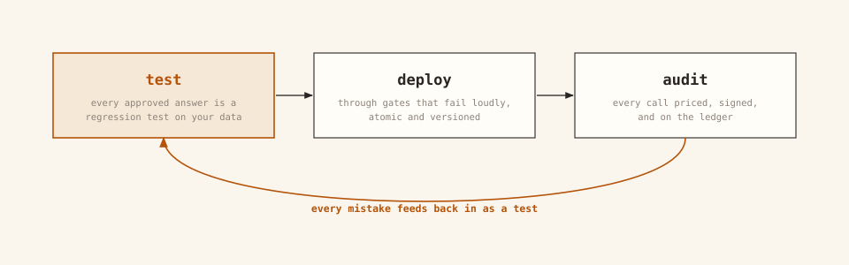
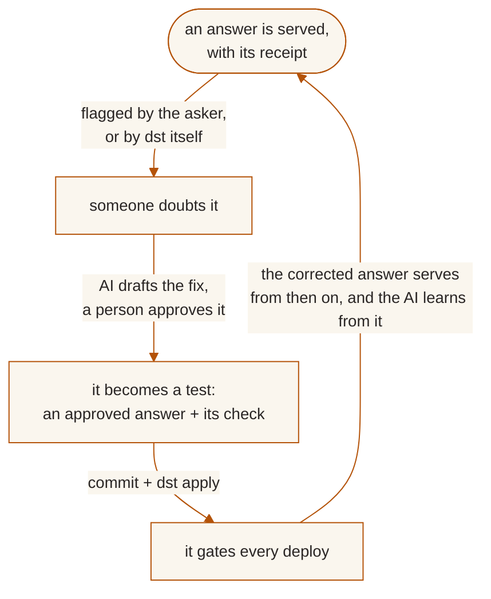

<p align="center"></p>

# data serve tool (dst)

**dst serves your warehouse to AI, and brings engineering best practice to
the whole lifecycle of doing it.** The AI asks in plain language; dst answers
from definitions your team wrote down, with the SQL that produced the answer,
a confidence grade, and a receipt attached.

<p align="center">
  
</p>

**The problem**

- Point an AI at a warehouse and it answers everything. It never fails to
  answer, and that is the failure mode: a wrong answer is worse than no
  answer.
- It guesses what "revenue" means, and the number it returns looks exactly
  like a right one.
- Context alone does not fix this. AI is nondeterministic, and what works
  for another team, another model, or another quarter may not work for you.
- The only way to know is to test it, on your data, continuously.

**The solution**

<p align="center">
  
</p>

- **Declare** how your data is served, as files in version control.
- **Test** what actually works for you: every approved answer is a regression
  test, and every switch in the pipeline can be flipped and re-measured.
- **Deploy** only what passes, through gates that fail loudly.
- **Audit** everything that served: who asked, what ran, what it cost. Every
  mistake feeds back in as a new test.

*Built by practitioners, for practitioners: files, pull requests, CI, and
exit codes, not a new workflow.*

<p align="center">
  
</p>
<p align="center"><i>The whole surface: a folder of files, and the <code>dst</code> CLI.
<a href="https://www.dataservetool.com/on-screen/">Interactive version →</a></i></p>

---

## Test: the engine

Generation is nondeterministic at its core, so dst treats testing as the
product, not an afterthought.

- **Every approved answer is a regression test.** A certified answer is a
  question→SQL pair a person vouched for. `dst test` re-asks the question
  through the real generation pipeline, executes both the stored SQL and the
  generated SQL against your warehouse, and compares the results.
- **Behavior is pinned too.** Cases in `evals/cases.yaml` assert response
  *shape*: `expect: clarify | refuse | answer`. A lens that starts refusing
  answerable questions, or guessing instead of clarifying, fails its suite.
- **Every result is recorded.** Test runs land in the database, so accuracy
  is a number you can watch move, and deployments gate on it: a change that
  scores worse than the last publish is rejected.

<p align="center">
  
</p>
<p align="center">
  
</p>

The pipeline is tunable per lens (answer strictness, self-repair, per-answer
judging, gate hardness), and every flip is measurable: change one, run
`dst test`, and know. And when you want to know which parts earn their keep
*on your questions*, the bundled proving ground runs your question set through
the pipeline with features stripped one at a time:
`python -m services.benchmark --data ./data --strip <feature>`. The full tunable surface is
in the [configuration reference](docs/reference/configuration.md).

---

## Deploy: through gates

A lens is files. Changing what an answer means is a deployment, not an edit:

```
edit files → dst plan (dry run) → dst apply (gated, atomic)
```

`dst plan` shows what a change would do and exits 1 if apply would reject it:
plan predicts apply. `dst apply` is one transaction: connections are probed,
every stale certified answer re-runs against live generation, and any failure
deploys **nothing**; the prior version keeps serving.

<p align="center">
  
</p>
<p align="center">
  
</p>

- **Versions**: every publish snapshots a lens version; `dst lens log` shows
  what changed, when, and by whom (`human:ana@corp` / `token:ci`). Rollback is
  `git revert` + `dst apply`.
- **Environments are where you try things.** Each one is a separate dst: your
  laptop, a shared sandbox, production. Aim a sandbox at a different model, a
  different temperature, other tables, or a reworded definition, run
  `dst test`, and compare the scores — a sandbox costs one `dst bootstrap` on
  a server you already run. Shipping is applying the same git commit to
  production; nothing is copied between environments, and the files carry no
  per-environment sections to keep in sync.
- **CI runs the same commands you do.** The exit codes are the interface: a PR
  job runs `dst plan`; merge runs
  `dst apply --require-gates`; a schedule runs `dst test --all` and
  `dst drift`. A shipped GitHub Actions example is in
  [the environments guide](docs/guides/environments-and-ci.md).

---

## Audit: every answer, priced and signed

- **Receipts.** Every data answer carries a portable, HMAC-signed receipt:
  request id, lens, certification, and a hash of the exact SQL. It is
  verifiable later via the API or the `verify_receipt` MCP tool. Refusals carry no
  receipt: they make no data claim.
- **The ledger.** `dst observe` answers "who has been using this, and what
  for": every call with its question, SQL, outcome, and cost on both meters
  (AI and warehouse). Answered, declined, and errored are counted apart; a
  governed decline is an outcome, not an error.
- **Access, both ways.** Every allow *and* every deny lands in an append-only
  audit log, with the caller, the lens, and the reason.
- **The warehouse is watched.** `dst drift` diffs the live schema against the
  committed baseline and cross-references every change with the definitions
  and entities that read the changed tables. Exit codes: `0` clean, `2`
  changes, `1` changes that break something declared, `4` no baseline yet.
- **Doubt is a first-class input.** Any caller can send an answer for review;
  low-confidence answers can flag themselves (`auto_review`). An AI judge
  triages the full trace, a human rules, and the fix lands as a file plus a
  new test, which closes the loop:



A mistake fixed once stays fixed, and you can prove it: the corrected question
is served from its approved SQL from then on, and its test re-runs on every
apply. Details: [the correction loop](docs/guides/correction-loop.md).

---

## The model

**Lens**: the unit of serving. A use case (churn, sales comp, board metrics)
declared as a selection over your shared semantic assets, plus access rules and
its own clock. An agent asks a lens a natural-language question and gets a
grounded, cited answer.

**Semantic files**: entities and business definitions, written once as files,
shared by every lens that selects them. One metric, one definition; the word an
agent uses is what varies, never the meaning.

**Curated context**: the reviewed statements a lens may ground an answer on. Each
entry is deliberate, attributable, and versioned with the lens.

**Certified answers**: reviewed question-to-SQL pairs, served verbatim on a
match and re-run as regression tests by `dst test` and on every `dst apply`. A
corrected mistake becomes one of these, which is how it stays fixed.

**Govern**: access is managed the way you choose: per-lens allow-lists for
people and groups, per-caller API keys (`dst_…`), rate limits, and tenant
isolation enforced in the database (Postgres RLS). Stored warehouse
credentials are encrypted at rest.

**Observe**: every call is traced. Which lens, which caller, the question, the
SQL, the AI + warehouse cost, and the outcome, with answered, declined, and
errored counted apart. Answers can be sent for **review**: an AI judge audits
the reasoning trace and escalates to a human when needed.

---

## Agents are the interface

There is no query UI. The consumer is an agent: connect any MCP client (Claude
Desktop, Claude Code, Cursor, the agent inside your product) to the governed MCP
server at `/mcp` with just a URL and a scoped `dst_…` key
([services/mcp/README.md](services/mcp/README.md)). Every question runs the same
governed pipeline, so the answer is identical whichever agent asks:

```
agent (Claude Desktop · Claude Code · Cursor · your product's agent)
        │  MCP — one scoped dst_… key per person
        ▼
   dst  ── lens: semantic model + context + access
        │   ground → SQL guard → execute → compose (cited)
        ▼
   your warehouse (BigQuery · Snowflake · Postgres · MySQL · DuckDB)
        │
   trace + cost + review  →  Observe
```

Humans stay in the loop, not in the query path: the dashboard is the cockpit for
governing and observing what the files declare: the review queue, drift audits,
access, cost. Lenses are authored as files (`dst init` → edit → `plan`/`apply`),
never in a UI. (A REST door exists for wiring dst into your own agent:
[API reference](docs/reference/api.md).)

---

## What a project looks like

A project is files: versioned, reviewed in PRs, applied like infrastructure.
These are lightly trimmed from what `dst init` actually scaffolds (which parks
its demo semantic assets under `examples/`, so you can delete that folder
wholesale; the demo lens itself lives at `lenses/customer_value/`):

<details open>
<summary><b><code>semantic/entities/examples/orders.yaml</code></b>: a business object (source, fields, metrics, joins)</summary>

```yaml
name: orders
description: One row per order.
source:
  connection: jaffle
  table: orders
default_time_field: order_date
primary_key: [order_id]
fields:
  - {name: order_id,    type: integer}
  - {name: customer_id, type: integer}
  - {name: order_date,  type: date}
  - {name: status,      type: string}
  - {name: amount,      type: number, description: Order total (USD).}
metrics:
  - {name: revenue,     agg: sum,   expr: orders.amount, format: currency}
  - {name: order_count, agg: count, expr: orders.order_id}
  - name: average_order_value
    type: ratio
    numerator: revenue
    denominator: order_count
    format: currency
joins:
  - {right: customers, on: customers.customer_id = orders.customer_id,
     type: left, relationship: many_to_one}
```
</details>

<details>
<summary><b><code>semantic/definitions/*.md</code></b>: what terms mean, including “ask, don’t guess”</summary>

A definition binds a business term to SQL:

```markdown
---
metric: repeat_customer
sql: customers.number_of_orders > 1
---

A repeat customer has number_of_orders > 1.
```

And an **ambiguous** one makes dst clarify instead of guessing:

```markdown
---
metric: value
status: ambiguous
possible_mappings:
  - lifetime value — customers.customer_lifetime_value
  - order amount — orders.amount
---
```

The mappings are all it takes: dst builds the clarification from them, in
code, before any generation runs.
</details>

<details>
<summary><b><code>lenses/customer_value/lens.yaml</code></b>: a lens selects assets and sets policy</summary>

```yaml
name: customer_value
description: Customer lifetime value and order activity.
connections: [jaffle]
select:
  entities:
    - name: customers
    - name: orders
  definitions: [lifetime_value, repeat_customer, value]
model:
  temperature: 0.0
  answer_mode: balanced
instructions: Select explicit columns.
access:
  allow:
    - caller: alex        # deny-by-default; or `- group: everyone`
eval_gate: block          # a failing eval suite blocks the apply
auto_review: unverified   # low-confidence answers open review tickets
```
</details>

<details>
<summary><b><code>lenses/customer_value/certified_answers.yaml</code></b>: approved question→SQL pairs, served verbatim</summary>

```yaml
# Served VERBATIM on a match — and each one is a regression test:
# `dst test` re-asks the question and compares against this SQL's result.
- question: How many customers are repeat customers?
  sql: SELECT count(*) AS n FROM customers WHERE number_of_orders > 1
- question: What was total revenue?
  sql: SELECT sum(amount) AS revenue FROM orders
```
</details>

<details>
<summary><b><code>dst.yaml</code></b>: providers (BYOK) and warehouse connections; secrets stay in <code>.env</code></summary>

```yaml
name: analytics

providers:
  anthropic:
    type: anthropic
    api_key_env: DST_API_KEY_ANTHROPIC
  # any openai-compatible endpoint works: deepseek, ollama, vllm, groq …

connections:
  jaffle:
    type: duckdb
    config: {path: fixtures/jaffle_shop.duckdb}
  wh:
    type: bigquery                  # or snowflake, postgres, mysql
    config: {project: my-gcp-project}
    secret_env: DST_API_KEY_WH      # an inline key is a parse error
```
</details>

<details>
<summary><b><code>dst query</code></b>: a governed answer, with receipts</summary>

```console
$ dst query customer_value "How many customers are repeat customers?"
19 of the 100 customers are repeat customers.

sql: SELECT count(*) AS n FROM customers WHERE number_of_orders > 1
basis: A repeat customer has number_of_orders > 1.
confidence: verified · definition: repeat_customer

$ dst query customer_value "What is the average value of a customer?"
clarify: 'value' is ambiguous in this dataset — lifetime value (total
historical revenue per customer) or order amount (a single order's total)?
  - lifetime value — customers.customer_lifetime_value
  - order amount — orders.amount
```

A refusal or clarify is an outcome, not an error: dst asks rather than guesses.
</details>

---

## Quickstart

Install the package. Prerequisites: Python 3.12+, Docker (dst runs its own
Postgres), and an API key for at least one model provider: Anthropic, or any
openai-compatible endpoint (DeepSeek, Ollama, vLLM, Groq, most gateways).

```bash
pip install dst-core            # the CLI is `dst`
dst init analytics --warehouse demo --yes
cd analytics                    # put your provider key in the generated .env
dst dev                         # Postgres up + migrate + serve, one command

# in a second terminal, same directory
dst bootstrap --org me --email you@example.com
dst apply
dst query customer_value "How many customers are repeat customers?"
```

`dst init` scaffolds a project over a bundled **jaffle** DuckDB warehouse, so
apply and query work before you connect a real one. The released wheel carries
the migrations and the dashboard, so `dst dev` serves both at
`http://localhost:8000`. The
[quickstart](docs/quickstart.md) is the primary route and walks the
same path on to your own warehouse.

---

## Running from source

The contributor path: a checkout, the repo's own Makefile, and the dashboard
built by Vite instead of bundled. Prerequisites: the above plus
[uv](https://docs.astral.sh/uv/), Node 22+ and pnpm.

```bash
# 1. Backend deps
make install                 # uv sync

# 2. Configure — create .env in the repo root (see "Configuration" below)
echo 'DST_PROVIDERS={"anthropic": {"type": "anthropic", "api_key": "sk-ant-..."}}' > .env
# openai-compatible works the same:
#   {"ollama": {"type": "openai-compatible", "base_url": "http://localhost:11434/v1", "api_key": "unused"}}

# 3. Start Postgres (pgvector), run migrations, seed an org + admin token
make up
make migrate
make seed                    # prints a dstadm_… admin token — copy it

# 4. Run the API (http://localhost:8000)
make dev
```

Then the dashboard:

```bash
cd apps/web
pnpm install
pnpm dev                     # http://localhost:5173
```

Open the dashboard and paste the `dstadm_…` admin token (top-right) to govern the org:
review queue, drift audits, callers, cost. Lenses themselves are authored as files:
`uv run dst init` scaffolds one over the bundled **jaffle** DuckDB warehouse, so
`uv run dst apply` and `uv run dst query` work before you connect a real warehouse.
A source checkout does not put `dst` on your PATH — every command runs as
`uv run dst …`, which is what the Makefile targets do.

To let an agent query a lens: issue a caller key in **Settings**, add it to the lens's
allow-list in `lens.yaml`, `uv run dst apply`, and connect the agent over MCP.

---

## Configuration

Settings load from `.env` (see [services/config.py](services/config.py)). Common keys:

| Var | Required | Purpose |
|-----|----------|---------|
| `DST_PROVIDERS` | yes, at least one entry | Model providers, JSON keyed by name (BYOK; no vendor-named key vars). Types: `anthropic`, `openai-compatible`, `local`. Declaration order is the tier/cost preference; grounding, composition, the review judge, and the router all resolve through it. |
| embedding provider | for context features | An entry in `DST_PROVIDERS` serving an embedding model: any openai-compatible endpoint, or the keyless in-process `local` type (`uv sync --extra local-embed`). Certified matching is cosine over this. With no usable embedder it cannot fire at all, which every response's `degraded` list and `/ready`'s `certified_matching` say. |
| `FASTEMBED_CACHE_PATH` | optional | Where the `local` tier keeps its ONNX weights. Default `~/.cache/dst/fastembed` (`$XDG_CACHE_HOME` honoured), deliberately NOT fastembed's own default, which is the OS scratch directory macOS reaps out from under it. Point it at a mounted volume in a container. |
| `DST_SECRET_KEY` | to store creds | Fernet key encrypting stored warehouse/context credentials. `dst init` generates one; by hand: `python -c "from cryptography.fernet import Fernet; print(Fernet.generate_key().decode())"`. |
| `DATABASE_URL` / `DATABASE_ADMIN_URL` | defaults ok locally | App (RLS-enforced, non-superuser) and admin (migrations/seed) connections. |
| `CLERK_SECRET_KEY` / `CLERK_PUBLISHABLE_KEY` | optional | Hosted dashboard auth; the local login + admin token work without it. |

Warehouse and context-source credentials are **not** env vars: declare connections in
`dst.yaml` with a `secret_env` reference (see the [quickstart](docs/quickstart.md)).
`.env.example` is generated from [services/config.py](services/config.py): the full,
never-stale surface.

---

## Project layout

```
services/          FastAPI app (services.app:app)
  api/             control plane (/mgmt/*) + data plane (/v1/*)
  contracts/       lens config, semantic model, protocols
  connectors/      warehouse connectors
  context/         embedding providers + the serving error surface
  runtime/         the query pipeline (ground → guard → execute → compose)
  reviews/         AI-judge + human review queue
  governance/      access policy, credentials, rate limits, audit
  mcp/             remote + stdio MCP server (see its README)
apps/web/          React + Vite dashboard
migrations/        Alembic migrations
fixtures/          built-in jaffle DuckDB warehouse
```

---

## Development

| Command | What it does |
|---|---|
| `make up` / `make down` | Start / stop local Postgres (pgvector) |
| `make migrate` | Apply DB migrations (`dst migrate`: schema + app-role password sync) |
| `make seed` | Seed a dev org + admin token |
| `make dev` | Run the API with reload on :8000 |
| `make lint` | `ruff` + format check + `mypy` + the UI style gate |
| `make fmt` | Auto-format + fix |
| `make test` | Backend tests (`pytest`) |
| `pnpm --dir apps/web dev` | Dashboard on :5173 |

Architecture: a FastAPI backend over Postgres + pgvector (lens config, the context
vector store, request traces, reviews) reads from your warehouse; the result set
itself is not persisted. What a trace does keep is the question, the SQL, the
composed answer and its citations; the first few result rows are kept only when a lens
opts in with `logging.log_samples`. Warehouse profiling additionally
stores per-column statistics and low-cardinality value lists; a column named in
`exclude_columns` is read for shape alone and its values are never collected. dst
does not classify or redact personal data: do not expose columns whose values you
do not want leaving your network. The dashboard is a same-origin or split React SPA.

User documentation lives in [docs/](docs/) (quickstart, concepts,
guides, reference) and is published at <https://www.dataservetool.com>; the
subsystem map for contributors is [ARCHITECTURE.md](ARCHITECTURE.md).

---

## License

[Apache-2.0](LICENSE). Contributions: [CONTRIBUTING.md](CONTRIBUTING.md) ·
vulnerabilities: [SECURITY.md](SECURITY.md) · issues and questions:
[github.com/get-dst/dst/issues](https://github.com/get-dst/dst/issues).
