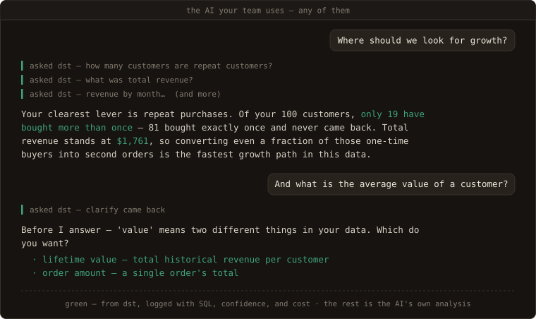
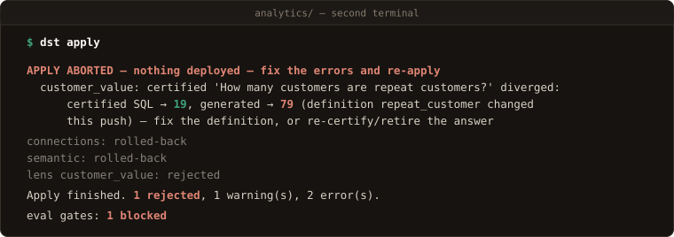
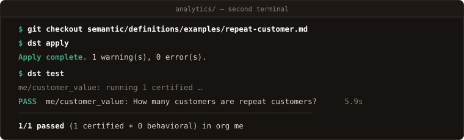
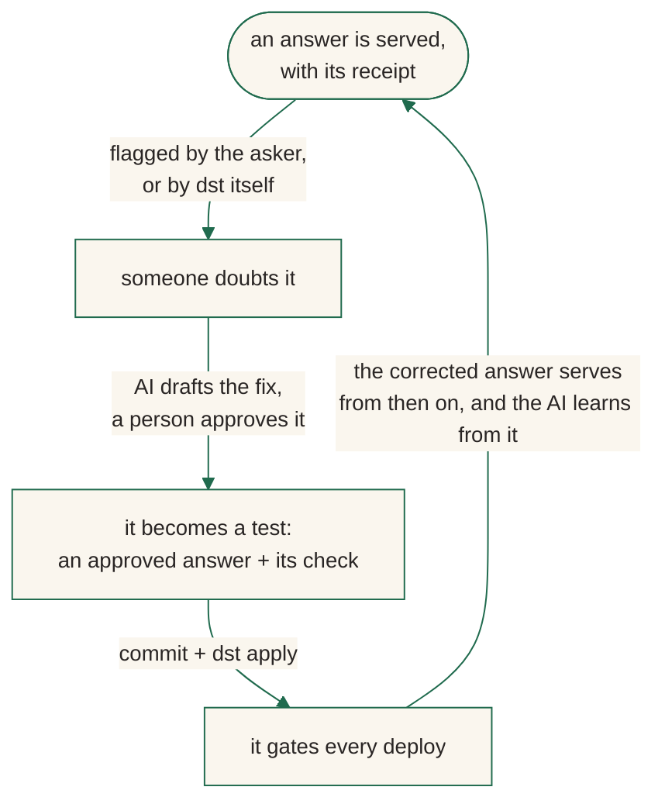

<p align="center"></p>

# data serve tool (dst)

**dst serves your warehouse to AI, and brings engineering best practice to
the whole lifecycle of doing it.** The AI asks in plain language; dst answers
from definitions your team wrote down, with the SQL that produced the answer,
a confidence grade, and a receipt attached.

The shape of it: one governed interface between the AI your team uses and
your warehouse — four questions answered on every call, and a receipt to
prove it:

<p align="center">
  
</p>

In use, from the seat most of your company sits in — their own AI, answering
through that interface:

<p align="center">
  
</p>
<p align="center"><i>The person sees conclusions, not queries — and never sees dst at all.
<a href="https://www.dataservetool.com/on-screen/">The interactive version →</a></i></p>

Notice who did what. The *analysis* came from the AI your team already uses —
dst is not the analyst, and it hands back no recommendations. What dst handed
that AI is the numbers worth standing on: each one resolved from your team's
definitions, tested, priced, and signed. The judgment stays with the asker;
the facts arrive governed. And when a word is ambiguous — "value", above —
dst sends back a question, not a guess: a clarify or a refusal is an outcome,
not an error.

Point an AI straight at the warehouse instead, and you get the opposite:

- It answers everything. It never fails to answer, and that is the failure
  mode: **a wrong answer is worse than no answer.**
- It guesses what "revenue" means, and the wrong number looks exactly like a
  right one — same decimals, same confidence.
- More context alone does not fix it. AI is nondeterministic, and what works
  for another team, another model, or another quarter may not work for you.
  The only way to know is to **test it, on your data, continuously**.

dst is that layer. Everything below takes a few minutes, on a bundled demo
warehouse.

## Quickstart

Prerequisites: Python 3.12+, Docker (dst runs its own Postgres), and an API
key for one model provider — Anthropic, or any openai-compatible endpoint
(DeepSeek, Ollama, vLLM, Groq, most gateways).

```console
$ pip install dst-core                       # the CLI is `dst`
$ dst init analytics --warehouse demo --yes
initialized dst project 'analytics' in …/analytics/
  warehouse: demo
  next: fill the DST_API_KEY_* lines in .env, then `dst dev`
$ cd analytics
$ dst dev
 Container dst-analytics-db-1 Started
schema created at 0061
app role 'dst_app' password synced from DATABASE_URL
dashboard: serving from …/site-packages/services/web_dist
INFO:     Uvicorn running on http://127.0.0.1:8000 (Press CTRL+C to quit)
```

In a second terminal, same directory:

```console
$ dst bootstrap --org me --email you@example.com
org: me (313df858-…) — created
admin token (store it now — shown once): dstadm_D7fB…
saved to .env as DST_ADMIN_TOKEN — dst commands here read it automatically
dashboard login: you@example.com (admin)
$ dst apply
connections: created 'jaffle' (duckdb)
  jaffle: read ✓ · query ✓ · query history ✓
semantic: created definition/lifetime_value, created definition/repeat_customer, …
lens customer_value: created
  … 6 warnings — governance hints for a fresh project (empty allow-list, unarmed gate, …)
Apply complete. 6 warning(s), 0 error(s). (--json for the row array)
eval gates: 1 skipped (1 empty suite)
```

That is the whole product, running:

- **The server** — `http://localhost:8000`. Agents ask it questions over MCP;
  the dashboard on the same port is the cockpit: ledger, review queue, access,
  cost.
- **The project** — `analytics/`, files declaring everything the server may
  serve. The scaffold ships a demo warehouse (DuckDB: customers and orders —
  the same project the chat above runs on), so nothing else is needed yet.
- **The gates** — `dst plan / apply / test`. Files reach the server through
  them and no other way. `dst apply` was your first deploy: that is why
  customer_value is live.

Pointing it at a real warehouse — BigQuery, Snowflake, Postgres, or MySQL —
is one config block ([quickstart](docs/quickstart.md)).

## Break something

Ask your running dst the question from the chat. The CLI is just another
caller — an agent connected over MCP runs the identical pipeline:

```console
$ dst query customer_value "How many customers are repeat customers?"
There are 19 repeat customers, defined as those with more than 1 order.

sql: SELECT COUNT(customers.customer_id) AS repeat_customer_count FROM customers AS customers WHERE customers.number_of_orders > 1
basis: Computed as `repeat_customer` — A repeat customer has number_of_orders > 1. (governed definition)
confidence: verified · definition: repeat_customer
request_id: req_d4942388afbc4a6e
```

The apply above ended with `eval gates: 1 skipped (1 empty suite)` — the
regression gate exists, but a fresh project has nothing certified, because
vouching is a human act. So vouch for the answer you just checked: append it
to the lens's certified corpus, with the request id as its provenance:

```yaml
# lenses/customer_value/certified_answers.yaml
- question: How many customers are repeat customers?
  sql: SELECT COUNT(customers.customer_id) AS repeat_customer_count FROM customers AS customers WHERE customers.number_of_orders > 1
  source: "dst query req_d4942388afbc4a6e — verified against jaffle"
  verified_by: me
```

```console
$ dst apply
…
Apply complete. 7 warning(s), 0 error(s). (--json for the row array)
eval gates: 1 passed
```

Your approved answer is now a regression test that runs on every deploy.
Prove it — change what "repeat customer" means:

```diff
 # semantic/definitions/examples/repeat-customer.md
-sql: customers.number_of_orders > 1
+sql: customers.number_of_orders >= 1
```

`dst plan` names everything the change touches:

```console
$ dst plan
  ~ semantic/definitions/examples/repeat-customer.md
  ~ customer_value — STALE compile (shared changed: definition/repeat_customer)
  ! customer_value: 1 certified answer(s) need re-verify (--full lists them)
Plan: 1 to change, 5 unchanged. (--full shows diffs and hints)
```

…and `dst apply` re-runs the certified answer against live generation under
the new meaning, and blocks:

<p align="center">
  
</p>

dst caught that an answer somebody vouched for would silently change, and
deployed nothing. The error names your fork:

- **The change was a mistake** → fix the definition: revert the file.
- **The change was intended** → re-certify the answer with its new SQL, or
  retire it (`status: retired` keeps its history).

<p align="center">
  
</p>

Every certified answer is a tripwire like this, and the suite grows every
time someone approves an answer or fixes a mistake.

## The flywheel

What you just did — catch a break, rule on it, keep the test — is the whole
design in miniature. dst treats serving like software (**declare** in files,
**test**, **deploy** through gates, **audit** everything that served)
precisely so that using the system is what improves it:

<p align="center">
  
</p>

- **Every approved answer improves the system.** Certified once, it is served
  verbatim on a match and re-verified on every deploy and every `dst test` —
  permanently. The suite only grows.
- **Every query makes it more rigorous.** Each call lands on the ledger with
  its SQL, confidence, and cost — reviewable, flaggable, and one approval away
  from joining the suite as a test.
- **Every review raises accuracy.** A doubted answer is triaged by an AI
  judge and ruled on by a person, and the ruling lands as files: a sharper
  definition, a new certified answer, a new behavior pin.
- **Every deploy re-proves the record.** Apply re-runs every certified answer
  against live generation, and a change that scores worse than the last
  publish is rejected. Accuracy can climb; it cannot silently fall.



Day one, your project carries the single answer you certified above. Six
months in, a lived-in project carries every question your team vouched for
and every mistake it ever caught — as tests that run on every change. A
mistake fixed once stays fixed, and you can prove it.
[The correction loop →](docs/guides/correction-loop.md)

## How it works

The whole model is three terms — you used all of them above:

- **Lens** — the unit of serving. One use case, declared as files: a selection
  over your shared semantic assets (entities, definitions), plus access rules
  and its own clock. Agents ask a lens; the lens decides what the words mean
  and which tables answer. `customer_value` is a lens.
- **Certified answer** — a question→SQL pair a person vouched for. Served
  verbatim on a match, re-run as a regression test by `dst test` and on every
  `dst apply`. A corrected mistake becomes one, which is how it stays fixed.
- **Receipt** — the signed proof on every data answer: request id, lens,
  certification, a hash of the exact SQL. Verifiable later via the API or the
  `verify_receipt` MCP tool. A refusal earns no receipt — there is no data
  claim to attest — but it is not lost: like every call, it lands on the
  ledger with its question and reason, and is counted apart from errors.

**Test — the engine.** Generation is nondeterministic at its core, so dst
treats testing as the product, not an afterthought. `dst test` re-asks every
certified question through the real pipeline and compares results against the
vouched SQL; cases in `evals/cases.yaml` pin behavior itself
(`expect: clarify | refuse | answer`), so a lens that starts guessing instead
of clarifying fails its suite. Results land in the database: accuracy is a
number you can watch move, and a change that scores worse than the last
publish is rejected. Every pipeline switch is tunable per lens and
re-measurable — change one, run `dst test`, and know.
[Configuration reference →](docs/reference/configuration.md)

**Deploy — through gates.** `edit files → dst plan (dry run) → dst apply
(gated, atomic)`. Plan is the static dry run: parse errors, contradictions,
and the blast radius of a change die there, and it names what apply will
re-verify. The live checks — connection probes, every stale certified answer
re-run against generation, the eval gate — run inside apply, which is one
transaction: any failure deploys **nothing**; the prior version keeps
serving. Every publish is a version (`dst lens log` shows what changed, when,
by whom); rollback is `git revert` + `dst apply`. Environments are separate
dsts (laptop, sandbox, production) shipping the same commit, and CI runs the
same commands you do — the exit codes are the interface.
[Environments & CI →](docs/guides/environments-and-ci.md)

**Audit — every answer, priced and signed.** `dst observe` is the ledger:
every call with its question, SQL, outcome, and cost on both meters (AI and
warehouse), with answered, declined, and errored counted apart. Every allow
*and* every deny lands in an append-only audit log. `dst drift` diffs the
live warehouse schema against the committed baseline and names which declared
definitions the change breaks.

## Agents are the interface

There is no query UI. The consumer is an agent: connect any MCP client
(Claude Desktop, Claude Code, Cursor, the agent inside your product) to the
governed MCP server at `/mcp` with a URL and a scoped `dst_…` key
([services/mcp/README.md](services/mcp/README.md)). Every question runs the
same governed pipeline, so what comes back is identical whichever agent
asks — a cited data answer, never an analysis; what the agent builds on it is
the agent's:

```
agent (Claude Desktop · Claude Code · Cursor · your product's agent)
        │  MCP — one scoped dst_… key per person
        ▼
   dst  ── lens: semantic model + context + access
        │   ground → SQL guard → execute → compose (cited)
        ▼
   your warehouse (BigQuery · Snowflake · Postgres · MySQL · DuckDB)
        │
   trace + cost + review  →  Observe
```

Humans stay in the loop, not in the query path: the dashboard is the cockpit
for governing and observing what the files declare — the review queue, drift
audits, access, cost. Lenses are authored as files, never in a UI. (A REST
door exists for wiring dst into your own agent:
[API reference](docs/reference/api.md).)

## What a project looks like

A project is a folder in version control, reviewed in PRs and applied like
infrastructure. Every answer above stood on one of these files:

```
analytics/
├── dst.yaml                                   # providers + warehouse connections (secrets stay in .env)
├── semantic/                                  # shared by every lens
│   ├── entities/examples/orders.yaml          #   business objects: fields, metrics, joins
│   └── definitions/examples/repeat-customer.md#   what words mean — the file you broke above
└── lenses/customer_value/                     # one governed use case
    ├── lens.yaml                              #   selected assets + access rules + policy
    ├── certified_answers.yaml                 #   vouched question→SQL pairs — you appended the first
    └── evals/cases.yaml                       #   behavior pins: expect clarify | refuse | answer
```

<details>
<summary><b><code>semantic/entities/examples/orders.yaml</code></b> — a business object (as scaffolded, empty defaults trimmed)</summary>

```yaml
name: orders
description: One row per order.
source:
  connection: jaffle
  table: orders
default_time_field: order_date
primary_key:
- order_id
fields:
- name: order_id
  type: integer
- name: customer_id
  type: integer
- name: order_date
  type: date
- name: status
  type: string
- name: amount
  type: number
  description: Order total (USD).
metrics:
- name: revenue
  agg: sum
  expr: orders.amount
  format: currency
- name: order_count
  agg: count
  expr: orders.order_id
- name: average_order_value
  type: ratio
  numerator: revenue
  denominator: order_count
  format: currency
joins:
- right: customers
  'on': customers.customer_id = orders.customer_id
  type: left
  relationship: many_to_one
```
</details>

<details>
<summary><b><code>lenses/customer_value/lens.yaml</code></b> — a lens selects assets and sets policy (as scaffolded, inline reference docs trimmed)</summary>

```yaml
name: customer_value
display_name: Customer Value
description: Customer lifetime value and order activity over the jaffle dataset.
connections:
- jaffle
select:
  entities:
  - name: customers
  - name: orders
  definitions:
  - lifetime_value
  - repeat_customer
  - value
model:
  temperature: 0.0
  answer_mode: balanced
  answer_contract: strict
instructions: Select explicit columns.
access:
  allow: []           # deny-by-default: admin-only until callers are added
eval_gate: block      # a failing eval suite blocks the apply
auto_review: 'off'
```
</details>

<details>
<summary><b><code>lenses/customer_value/certified_answers.yaml</code></b> — the corpus starts empty; entries are appended by people, or promoted from review rulings</summary>

```yaml
# Approved question->SQL pairs, served VERBATIM on a match -
# and each one is a regression test: `dst test` re-asks the
# question and compares against this SQL's RESULT.
- question: How many customers are repeat customers?
  sql: SELECT COUNT(customers.customer_id) AS repeat_customer_count FROM customers AS customers WHERE customers.number_of_orders > 1
  source: "dst query req_d4942388afbc4a6e — verified against jaffle"
  verified_by: me
```
</details>

To see both seats of this same project side by side — the chat from the top
of this page and the files it stands on, live and clickable:
[**the product, on screen →**](https://www.dataservetool.com/on-screen/)

## Beyond the quickstart

- **Connect your warehouse & providers** —
  [quickstart](docs/quickstart.md) (BYOK: Anthropic or any
  openai-compatible endpoint; credentials via `secret_env`, never inline)
- **Environments & CI** —
  [guide](docs/guides/environments-and-ci.md), with a shipped GitHub
  Actions example
- **Configuration reference** —
  [every setting](docs/reference/configuration.md), generated from
  source, never stale
- **Run from source / contribute** — [CONTRIBUTING.md](CONTRIBUTING.md) ·
  subsystem map in [ARCHITECTURE.md](ARCHITECTURE.md)
- **All documentation** — <https://www.dataservetool.com>

## License

[Apache-2.0](LICENSE). Contributions: [CONTRIBUTING.md](CONTRIBUTING.md) ·
vulnerabilities: [SECURITY.md](SECURITY.md) · issues and questions:
[github.com/get-dst/dst/issues](https://github.com/get-dst/dst/issues).
