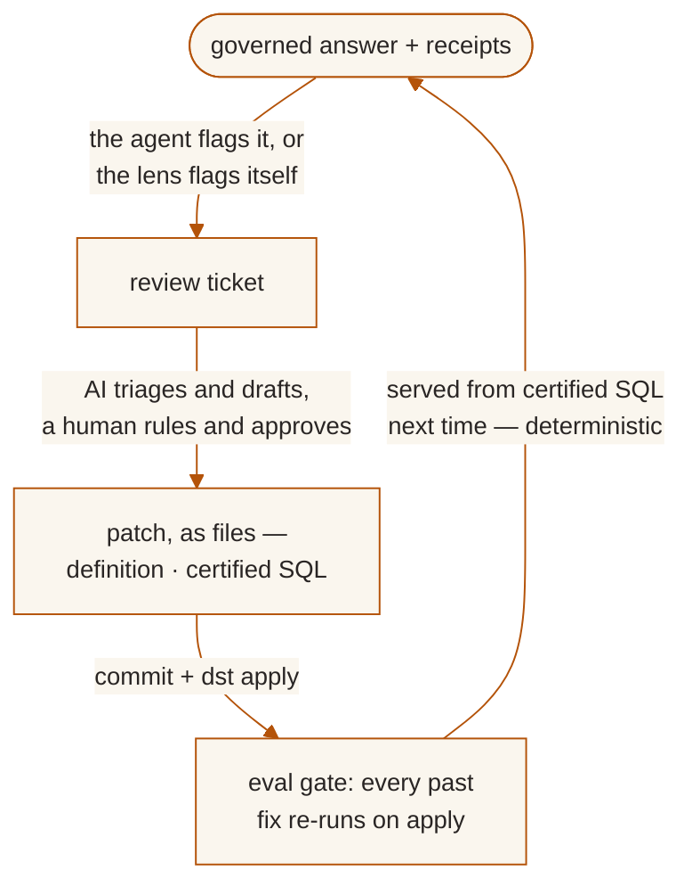
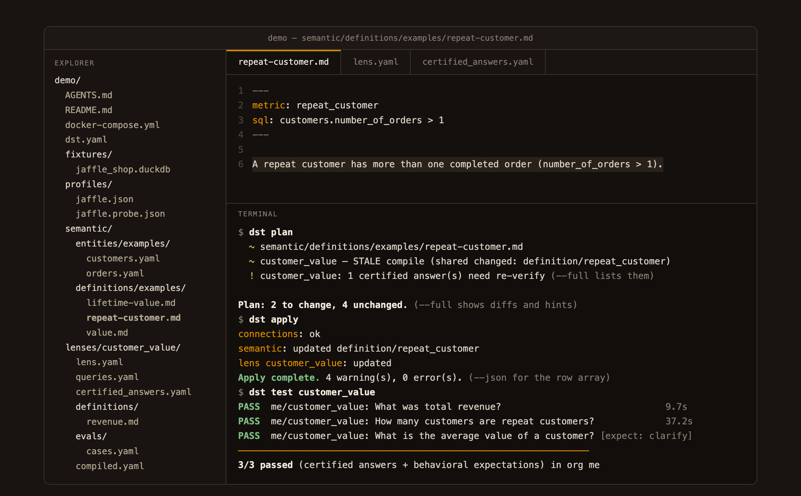
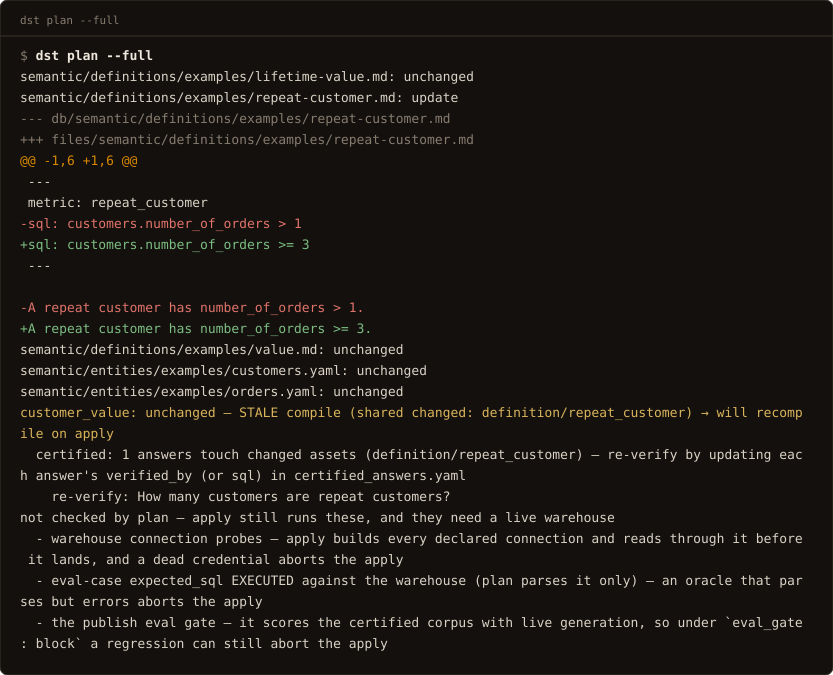
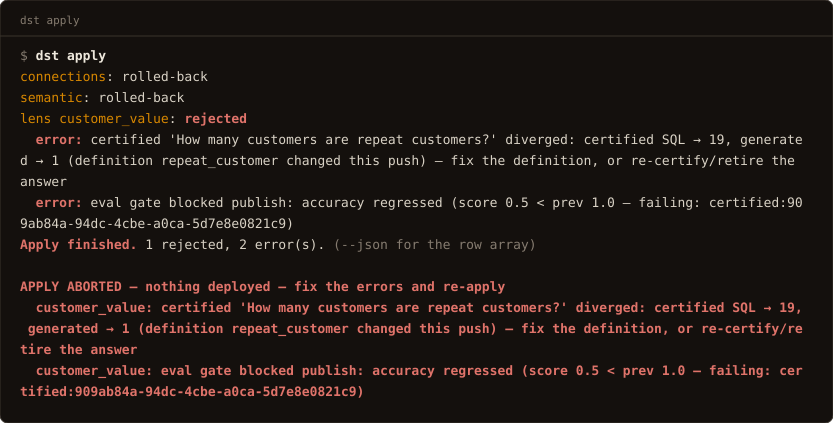

<p align="center"></p>

# data serve tool (dst)

**dst serves your warehouse to AI agents.** Not raw tables, not a SQL prompt.
The agent asks in plain language; dst answers from definitions your team wrote
down, with the SQL that produced the answer, a verification grade, and a
receipt attached.

## Why AI gets your numbers wrong

Point an agent at a warehouse and it answers everything, confidently. It
guesses which table means "revenue", invents the definition on the spot, and
returns a number that looks exactly like a right one. Ask twice and you get two
answers. Nobody can say where either came from, and nothing stops the same
mistake from happening again tomorrow.

The failure is not the model. AI is nondeterministic by nature; the failure is
that nothing between the question and the warehouse holds a definition still,
checks the answer against it, or remembers the last correction. dst is that
layer, and it works by putting a collar on the model: versioned deployments,
regression tests, audit trails, and evals — the controls your data team already
trusts, applied to AI answers. You define how data is exposed (once, as files),
it slots in as the serve stage of the stack you already run, and every agent,
whether Claude on an analyst's laptop or the agent inside your product, goes
through the same governed interface.

<p align="center"></p>

---

## The model

**Lens**: the unit of serving. A use case (churn, sales comp, board metrics)
declared as a selection over your shared semantic assets, plus access rules and
its own clock. An agent asks a lens a natural-language question and gets a
grounded, cited answer.

**Semantic files**: entities and business definitions, written once as files,
shared by every lens that selects them. One metric, one definition; the word an
agent uses is what varies, never the meaning.

**Curated context**: the reviewed statements a lens may ground an answer on. Each
entry is deliberate, attributable, and versioned with the lens.

**Certified answers**: reviewed question-to-SQL pairs, served verbatim on a
match and re-run as regression tests by `dst test` and on every `dst apply`. A
corrected mistake becomes one of these, which is how it stays fixed.

**Govern**: access is policy, not assumption. Deny-by-default per-lens
allow-lists, per-caller API keys (`dst_…`), rate limits, and tenant isolation
enforced in the database (Postgres RLS). Stored warehouse credentials are
encrypted at rest.

**Observe**: every call is traced. Which lens, which caller, the question, the
SQL, the AI + warehouse cost, and the outcome, with answered, declined, and
errored counted apart. Answers can be sent for **review**: an AI judge audits
the reasoning trace and escalates to a human when needed.

---

## Agents are the interface

There is no query UI. The consumer is an agent: connect any MCP client (Claude
Desktop, Claude Code, Cursor, the agent inside your product) to the governed MCP
server at `/mcp` with just a URL and a scoped `dst_…` key
([services/mcp/README.md](services/mcp/README.md)). Every question runs the same
governed pipeline, so the answer is identical whichever agent asks:

```
agent (Claude Desktop · Claude Code · Cursor · your product's agent)
        │  MCP — one scoped dst_… key per person
        ▼
   dst  ── lens: semantic model + context + access
        │   ground → SQL guard → execute → compose (cited)
        ▼
   your warehouse (BigQuery · Snowflake · Postgres · MySQL · DuckDB)
        │
   trace + cost + review  →  Observe
```

Humans stay in the loop, not in the query path: the dashboard is the cockpit for
governing and observing what the files declare: the review queue, drift audits,
access, cost. Lenses are authored as files (`dst init` → edit → `plan`/`apply`),
never in a UI. (A REST door exists for wiring dst into your own agent:
[API reference](docs/reference/api.md).)

---

## The flywheel

A wrong answer ends as a file in your repo plus a regression test proving it
stays fixed:



The AI drafts, the human approves, the fix lands as a file, so it survives every
future `dst apply` and re-runs as a test on each one. And a corrected question is
served from its certified SQL from then on: deterministic, and cheaper and faster
than generation. Details: [the correction loop](docs/guides/correction-loop.md).

---

## What it looks like

The whole product surface an engineer touches — a folder of files, and
`dst plan` / `dst apply` to preview and publish changes
([interactive version](https://www.dataservetool.com/on-screen/)):

<p align="center">
  
</p>

A definition change rides `plan → apply → test` like infrastructure — and one
that breaks a certified answer cannot ship:

<p align="center">
  
</p>
<p align="center">
  
</p>

A project is files: versioned, reviewed in PRs, applied like infrastructure.
These are lightly trimmed from what `dst init` actually scaffolds (which parks
its demo assets under `examples/`, so you can delete the folder wholesale):

<details open>
<summary><b><code>semantic/entities/examples/orders.yaml</code></b>: a business object (source, fields, metrics, joins)</summary>

```yaml
name: orders
description: One row per order.
source:
  connection: jaffle
  table: orders
default_time_field: order_date
primary_key: [order_id]
fields:
  - {name: order_id,    type: integer}
  - {name: customer_id, type: integer}
  - {name: order_date,  type: date}
  - {name: status,      type: string}
  - {name: amount,      type: number, description: Order total (USD).}
metrics:
  - {name: revenue,     agg: sum,   expr: orders.amount, format: currency}
  - {name: order_count, agg: count, expr: orders.order_id}
  - name: average_order_value
    type: ratio
    numerator: revenue
    denominator: order_count
    format: currency
joins:
  - {right: customers, on: customers.customer_id = orders.customer_id,
     type: left, relationship: many_to_one}
```
</details>

<details>
<summary><b><code>semantic/definitions/*.md</code></b>: what terms mean, including “ask, don’t guess”</summary>

A definition binds a business term to SQL:

```markdown
---
metric: repeat_customer
sql: customers.number_of_orders > 1
---

A repeat customer has number_of_orders > 1.
```

And an **ambiguous** one makes dst clarify instead of guessing:

```markdown
---
metric: value
status: ambiguous
possible_mappings:
  - lifetime value — customers.customer_lifetime_value
  - order amount — orders.amount
---

ASK the user: 'value' is ambiguous in this dataset — lifetime value
(total historical revenue per customer) or order amount (a single
order's total)?
```
</details>

<details>
<summary><b><code>lenses/customer_value/lens.yaml</code></b>: a lens selects assets and sets policy</summary>

```yaml
name: customer_value
description: Customer lifetime value and order activity.
connections: [jaffle]
select:
  entities:
    - name: customers
    - name: orders
  definitions: [lifetime_value, repeat_customer, value]
model:
  temperature: 0.0
  answer_mode: balanced
instructions: Select explicit columns.
access:
  allow:
    - caller: alex        # deny-by-default; or `- group: everyone`
eval_gate: block          # a failing eval suite blocks the apply
auto_review: unverified   # low-confidence answers open review tickets
```
</details>

<details>
<summary><b><code>lenses/customer_value/certified_answers.yaml</code></b>: approved question→SQL pairs, served verbatim</summary>

```yaml
# Served VERBATIM on a match — and each one is a regression test:
# `dst test` re-asks the question and compares against this SQL's result.
- question: How many customers are repeat customers?
  sql: SELECT count(*) AS n FROM customers WHERE number_of_orders > 1
- question: What was total revenue?
  sql: SELECT sum(amount) AS revenue FROM orders
```
</details>

<details>
<summary><b><code>dst.yaml</code></b>: providers (BYOK) and warehouse connections; secrets stay in <code>.env</code></summary>

```yaml
name: analytics

providers:
  anthropic:
    type: anthropic
    api_key_env: DST_API_KEY_ANTHROPIC
  # any openai-compatible endpoint works: deepseek, ollama, vllm, groq …

connections:
  jaffle:
    type: duckdb
    config: {path: fixtures/jaffle_shop.duckdb}
  wh:
    type: bigquery                  # or snowflake, postgres, mysql
    config: {project: my-gcp-project}
    secret_env: DST_API_KEY_WH      # an inline key is a parse error
```
</details>

And the lifecycle is terraform-shaped (plan, apply, test):

<details open>
<summary><b><code>dst plan</code></b>: dry run of what would change, what's stale, what's invalid</summary>

```console
$ dst plan
  + semantic/definitions/net-revenue.md
  ~ semantic/entities/orders.yaml
  ~ customer_value — STALE compile (shared changed: entity/orders)
  ! customer_value: 2 certified answer(s) need re-verify (--full lists them)

Plan: 1 to add, 2 to change, 11 unchanged. (--full shows diffs and hints)
```

A plan with invalid files exits 1: plan predicts apply.
</details>

<details>
<summary><b><code>dst apply</code></b>: deploy the files (all-or-nothing, connections probed first)</summary>

```console
$ dst apply
connections: ok
semantic: created definition/net_revenue, updated entity/orders
lens customer_value: updated
Apply complete. 0 error(s). (--json for the row array)
eval gates: 1 passed
```

One transaction: any error aborts everything and the prior versions keep serving.
</details>

<details>
<summary><b><code>dst query</code></b>: a governed answer, with receipts</summary>

```console
$ dst query customer_value "How many customers are repeat customers?"
20 of the 100 customers are repeat customers.

sql: SELECT count(*) AS n FROM customers WHERE number_of_orders > 1
basis: A repeat customer has number_of_orders > 1.
confidence: verified · definition: repeat_customer

$ dst query customer_value "What is the average value of a customer?"
clarify: 'value' is ambiguous in this dataset — lifetime value (total
historical revenue per customer) or order amount (a single order's total)?
  - lifetime value — customers.customer_lifetime_value
  - order amount — orders.amount
```

A refusal or clarify is an outcome, not an error: dst asks rather than guesses.
</details>

<details>
<summary><b><code>dst test</code></b>: the certified corpus as the regression suite</summary>

```console
$ dst test customer_value
PASS  me/customer_value: How many customers are repeat customers?  1.9s
PASS  me/customer_value: What was total revenue?  2.4s
PASS  me/customer_value: What is the average value of a customer? [expect: clarify]  1.2s
────────────────────────────────────────────────────────────────
3/3 passed (2 certified + 1 behavioral) in org me
```

Exit codes a deploy gate can branch on: `0` verified green, `1` something
diverged, `4` *nothing was verified*.
</details>

---

## Quickstart (local)

Prerequisites: [uv](https://docs.astral.sh/uv/), Docker (for Postgres), Node 20+ and
pnpm (for the dashboard), and an API key for at least one model provider: Anthropic,
or any openai-compatible endpoint (DeepSeek, Ollama, vLLM, Groq, most gateways).

```bash
# 1. Backend deps
make install                 # uv sync

# 2. Configure — create .env in the repo root (see "Configuration" below)
echo 'DST_PROVIDERS={"anthropic": {"type": "anthropic", "api_key": "sk-ant-..."}}' > .env
# openai-compatible works the same:
#   {"ollama": {"type": "openai-compatible", "base_url": "http://localhost:11434/v1", "api_key": "unused"}}

# 3. Start Postgres (pgvector), run migrations, seed an org + admin token
make up
make migrate
make seed                    # prints a dstadm_… admin token — copy it

# 4. Run the API (http://localhost:8000)
make dev
```

Then the dashboard:

```bash
cd apps/web
pnpm install
pnpm dev                     # http://localhost:5173
```

Open the dashboard and paste the `dstadm_…` admin token (top-right) to govern the org —
review queue, drift audits, callers, cost. Lenses themselves are authored as files:
`dst init` scaffolds one over the bundled **jaffle** DuckDB warehouse, so `dst apply`
and `dst query` work before you connect a real warehouse.

To let an agent query a lens: issue a caller key in **Settings**, add it to the lens's
allow-list in `lens.yaml`, `dst apply`, and connect the agent over MCP.

---

## Configuration

Settings load from `.env` (see [services/config.py](services/config.py)). Common keys:

| Var | Required | Purpose |
|-----|----------|---------|
| `DST_PROVIDERS` | yes, at least one entry | Model providers, JSON keyed by name (BYOK; no vendor-named key vars). Types: `anthropic`, `openai-compatible`, `voyage`, `local`. Declaration order is the tier/cost preference; grounding, composition, the review judge, and the router all resolve through it. |
| embedding provider | for context features | An entry in `DST_PROVIDERS` serving an embedding model: any openai-compatible endpoint, Voyage (`uv sync --extra voyage`), or the keyless in-process `local` type (`uv sync --extra local-embed`). Certified matching is cosine over this. With no usable embedder it cannot fire at all, which every response's `degraded` list and `/ready`'s `certified_matching` say. |
| `FASTEMBED_CACHE_PATH` | optional | Where the `local` tier keeps its ONNX weights. Default `~/.cache/dst/fastembed` (`$XDG_CACHE_HOME` honoured), deliberately NOT fastembed's own default, which is the OS scratch directory macOS reaps out from under it. Point it at a mounted volume in a container. |
| `DST_SECRET_KEY` | to store creds | Fernet key encrypting stored warehouse/context credentials. `dst init` generates one; by hand: `python -c "from cryptography.fernet import Fernet; print(Fernet.generate_key().decode())"`. |
| `DATABASE_URL` / `DATABASE_ADMIN_URL` | defaults ok locally | App (RLS-enforced, non-superuser) and admin (migrations/seed) connections. |
| `CLERK_SECRET_KEY` / `CLERK_PUBLISHABLE_KEY` | optional | Hosted dashboard auth; the local login + admin token work without it. |

Warehouse and context-source credentials are **not** env vars: declare connections in
`dst.yaml` with a `secret_env` reference (see the [quickstart](docs/quickstart.md)).
`.env.example` is generated from [services/config.py](services/config.py): the full,
never-stale surface.

---

## Project layout

```
services/          FastAPI app (services.app:app)
  api/             control plane (/mgmt/*) + data plane (/v1/*)
  contracts/       lens config, semantic model, protocols
  connectors/      warehouse connectors (+ a GitHub importer)
  context/         chunk → embed → pgvector store + retrieval
  runtime/         the query pipeline (ground → guard → execute → compose)
  reviews/         AI-judge + human review queue
  governance/      access policy, credentials, rate limits, audit
  mcp/             remote + stdio MCP server (see its README)
apps/web/          React + Vite dashboard
migrations/        Alembic migrations
fixtures/          built-in jaffle DuckDB warehouse
```

---

## Development

| Command | What it does |
|---|---|
| `make up` / `make down` | Start / stop local Postgres (pgvector) |
| `make migrate` | Apply DB migrations (`alembic upgrade head`) |
| `make seed` | Seed a dev org + admin token |
| `make dev` | Run the API with reload on :8000 |
| `make lint` | `ruff` + format check + `mypy` + the UI style gate |
| `make fmt` | Auto-format + fix |
| `make test` | Backend tests (`pytest`) |
| `pnpm --dir apps/web dev` | Dashboard on :5173 |

Architecture: a FastAPI backend over Postgres + pgvector (lens config, the context
vector store, request traces, reviews) reads from your warehouse; the result set
itself is not persisted. What a trace does keep is the question, the SQL, the
composed answer and its citations — plus, only when a lens opts in with
`logging.log_samples`, the first few result rows. Warehouse profiling additionally
stores per-column statistics and low-cardinality value lists; a column named in
`exclude_columns` is read for shape alone and its values are never collected. dst
does not classify or redact personal data — do not expose columns whose values you
do not want leaving your network. The dashboard is a same-origin or split React SPA.

User documentation lives in [docs/](docs/) (quickstart, concepts,
guides, reference) and is published at <https://www.dataservetool.com>; the
subsystem map for contributors is [ARCHITECTURE.md](ARCHITECTURE.md).

---

## License

[Apache-2.0](LICENSE). Contributions: [CONTRIBUTING.md](CONTRIBUTING.md) ·
vulnerabilities: [SECURITY.md](SECURITY.md) · issues and questions:
[github.com/get-dst/dst/issues](https://github.com/get-dst/dst/issues).
