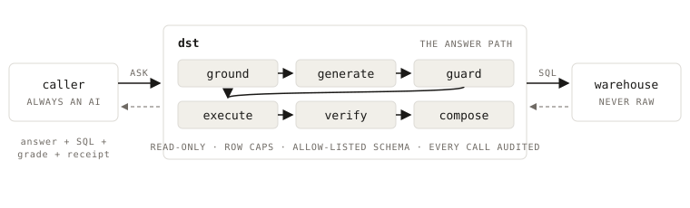

# The answer path



The **answer path** is everything that happens between a question and the
number that comes back. dst owns all of it, so the caller never touches the
warehouse:

```
caller ──▶ dst ──▶ warehouse
agents      lens · context        read-only,
analysts    certified patterns  guarded SQL
apps        receipts · refusal
```

The stages, in order:

1. **Ground.** The question is scoped to one [lens](lens.md), which selects the
   semantic files, governed definitions and [curated context](curated-context.md)
   the model may read. When the caller names no lens, a routing step picks one
   first, or declines.
2. **Match.** If a [certified answer](certified.md) covers the question, its
   approved SQL is served verbatim and generation is skipped.
3. **Check, then generate.** Before generation runs, deterministic code
   [clarifies or refuses](clarify-and-refusal.md) — an ambiguous governed term,
   a metric this lens leaves out. Otherwise the model writes SQL against that
   curated context.
4. **Guard.** The SQL is parsed and checked before it runs: single-statement
   and read-only, inside the lens's scope.
5. **Execute** against the warehouse, row-capped at execution. The connection
   itself is opened read-only where the driver supports it (DuckDB, Postgres,
   MySQL); on BigQuery and Snowflake the guard and the credential's own grants
   carry it.
6. **Compose and verify.** The prose is written, then the whole answer is
   graded and returned with the SQL, the confidence grade, and a
   [receipt](receipts.md).

Because every question travels the same path, access, cost, scope and
correctness are enforceable in one place. The alternative is giving the model
warehouse credentials and letting it author its own SQL: a wrong definition
that a person would quietly catch then gets repeated across a thousand
decisions at machine speed, and nobody learns the answer was wrong until
something downstream breaks. Describing the data better informs that model; it
does not limit what its credentials can run.

