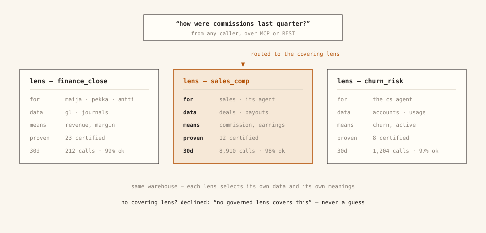

# Lenses

A **lens** is one use case, packaged: a job people need answers for —
commission questions, churn questions, the board's monthly numbers. Each lens
declares the three things that job needs:

- **A set of data**: which business objects are in scope (deals, payouts,
  customers). Each object already knows which warehouse and tables it comes
  from.
- **A set of context**: what the words mean *here* — your definitions,
  including the contested ones — plus anything else needed to read the data
  correctly.
- **A set of callers**: who may ask. Access starts fully closed; no caller key
  reaches a lens until you allow it (org admins are the exception — a lens
  with no callers is admin-only, and `dst apply` says so). Keys belong to
  people, not tools.

[](../assets/figures/fig2-lens.svg)

Under the hood, a lens is a selection: it picks which entities, definitions,
and approved answers it may use from the shared pool, and binds them to a
warehouse connection and an access list. When a question comes in, the lens
decides what the answer may touch and what the words in the question mean.
Lenses are named for use cases (`sales_comp`), never for tables.

A lens also says, in plain words, what it is *for*. The `use_when` lines in
`queries.yaml` state its purpose, and they are the lens's most direct lever on
routing when the caller didn't name a lens — dst builds the lens's routing
profile from them together with everything else the lens selected (its terms,
entity and metric names, sample queries, use cases). A lens with no `use_when`
is a lens that hasn't said what it is for. The lens `description` is
deliberately kept out of the scored anchors — it matches almost any question
and would over-route — but a shortlisted lens shows it to the decider
alongside them.

## One metric, one definition — the word is what varies

You should not give two teams two different "revenue" metrics. Metrics are
defined once, in the shared files, each one clearly itself: bookings is
bookings, recognized revenue is recognized revenue. What varies is which of
them the *word* "revenue" points to when a particular person says it: sales
says revenue and means bookings; finance says revenue and means recognized
revenue. Both are legitimate. The word is just doing double duty.

At that fork, dst's job is to **not guess**. Mark the term ambiguous, list its
possible meanings, and a question that uses it comes back as a question —
"which do you mean?" — before anything runs. Often a lens's own scope settles
it (a commission lens has only one revenue-like metric in play). When one word
is claimed by several metrics and nothing settles it, `dst apply` warns you by
name: govern the others, or mark the term ambiguous.

## Selection, not copy

`lens.yaml` names what the lens takes from the shared files, and `dst apply`
compiles that selection into what the lens actually serves from. A term the
lens selects from the shared files *and* also defines locally is an error at
apply time — never a silent winner. Metrics the lens didn't select are refused
outright, before any AI model is even called (see
[Clarification & refusal](clarify-and-refusal.md)) — including answers that
would quietly rebuild an unselected metric from raw columns.

The file layout:

```
semantic/                     # project scope, shared by every lens
  entities/deals.yaml         # table, grain, use/avoid, fields, metrics, joins
  definitions/commission.md   # governed term: frontmatter + prose
lenses/sales_comp/
  lens.yaml                   # the selection + policy (below)
  queries.yaml                # use_when + sample queries, lens-local
  definitions/*.md            # lens-LOCAL terms
  certified_answers.yaml      # approved question→SQL pairs
  evals/cases.yaml            # behavioral cases (expect: clarify | refuse)
```

```yaml
# lenses/sales_comp/lens.yaml (abridged)
name: sales_comp
connections: [bigquery]
select:
  entities:
    - name: reps
    - name: deals
    - name: payouts
  definitions: [commission, earnings]
access:
  allow: []        # deny-by-default; grant callers or groups explicitly
```

## Versioned like code

Every publish snapshots a numbered version of the lens, and any two versions
can be compared as a file diff. You review a lens change the way you review a
pull request, because structurally it is one.

## It asks; it never silently decides

When a question hinges on a word with more than one governed meaning, the lens
does not pick the likelier reading. It returns the question: which meaning do
you want? This happens in plain code, before any AI generation — so it happens
every time, not just when the model feels unsure.

!!! clarify "Clarify"
    "What is the average value per customer?" `value` is ambiguous here:
    lifetime value (`customers.customer_lifetime_value`) or order amount
    (`orders.amount`)? The answer is a question, not a guess.

Contested words usually surface through
[bootstrapping from history](../guides/drift-audit.md) — the same metric
computed several different ways in your warehouse's own query history — and
get recorded as ambiguous definitions rather than silently crowned winners.

## One agent, one lens

A lens bundles vocabulary, scope, and access in one object — so the natural
setup for AI agents is one scoped lens per agent, reached over MCP. What
`list_lenses` returns under the agent's key is its entire world. See
[Agents over MCP](../guides/agents-mcp.md).
