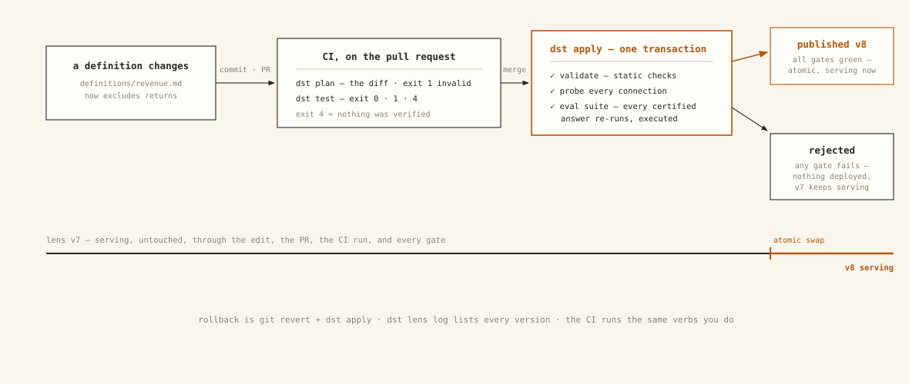

# Deploying

dst deploys as **one stateless container** (API + dashboard, same origin)
against **one Postgres with pgvector** that you provide. All state lives in
Postgres: lenses, curated context, certified answers, credentials (encrypted), traces;
the container keeps no state on disk (it wants a writable `/tmp` for Python scratch,
and a `local-embed` build caches model weights under `$HOME`). So the whole deployment
statement is:

> **pinned image tag + database URLs + `DST_SECRET_KEY` + `DST_PUBLIC_BASE_URL`**

Anything that can run that container against that database works: a VM with
compose, Kubernetes with the helm chart, Cloud Run. Images publish to GHCR on
every release tag; pin one, never `latest`.

Publishing a change is a CI/CD pipeline, not a console session — and the prior
version serves untouched until the atomic swap
([Environments and CI](guides/environments-and-ci.md) is that pipeline, end to end):

[](assets/figures/fig4-authoring.svg)

## The contract

In `DST_ENVIRONMENT=production` the server **fails startup by name** on a missing
`DST_SECRET_KEY` or `DST_PUBLIC_BASE_URL` — and on the well-known dev database
password — while DSNs without an `sslmode` get `sslmode=require` appended unless they
target a unix socket (libpq's default would silently connect unencrypted).

| Env var | Required (prod) | What |
|---|---|---|
| `DATABASE_URL` | yes | app DSN: the **non-superuser** `dst_app` role, so row-level security is enforced. Never a superuser: superusers bypass RLS, which silently disables tenant isolation |
| `DATABASE_ADMIN_URL` | yes | privileged DSN: `dst migrate`, and at runtime the scheduler, admin-token auth, and OAuth run on the admin engine |
| `DST_SECRET_KEY` | yes | Fernet key(s) encrypting stored warehouse credentials + OAuth code signing, **comma-separated** (first encrypts, all decrypt). Generate with `dst secret`. **Losing it orphans every stored credential**; to change it, follow the rotation sequence below rather than swapping it. Unset, multi-instance MCP OAuth breaks nondeterministically |
| `DST_PUBLIC_BASE_URL` | yes | the origin you serve at (`https://dst.example.com`). OAuth metadata and review links derive from it instead of trusting forwarded Host headers, and the MCP transport allowlists its hostname alongside the localhost forms (any other Host gets a 421) |
| `DST_ENVIRONMENT` | yes | `production` switches the contract on (and drops dev localhost CORS origins) |
| `DST_PROVIDERS` | no | LLM/embedding providers, JSON; see [Configuration](reference/configuration.md) |
| `PORT` | no | listen port (default 8000); the container binds `0.0.0.0` |
| `DST_CORS_ORIGINS` | no | comma-separated extra origins, only for split-origin frontends |
| `DST_MIGRATE_ON_START` | no | default `true`: entrypoint waits for the DB and migrates before serving (right for compose). Orchestrated deploys set `false` and run `dst migrate` once per release |
| `DST_DB_POOL_SIZE` / `DST_DB_MAX_OVERFLOW` / `DST_DB_POOL_RECYCLE` | no | per-engine pool knobs (defaults 5/10/1800s). Budget `instances × 2 engines × (pool_size + max_overflow)` under your Postgres `max_connections` |
| `DST_AUDIT_INTERVAL_HOURS` / `DST_EVAL_INTERVAL_HOURS` | no | standing drift audits / certified evals (default 24h). The in-process scheduler needs an always-on instance; it advisory-locks, so replicas don't duplicate work |

## Postgres requirements

- **pgvector ≥ 0.5.0** (the schema uses HNSW indexes): AWS RDS needs PG
  **15.5+/16.1+**, Cloud SQL PG 15+; Neon and Supabase ship it built in. The
  first migration runs `CREATE EXTENSION IF NOT EXISTS vector`.
- Migrations create the `dst_app` role and its grants (`0001`). **Always run
  migrations as the same admin role**: `ALTER DEFAULT PRIVILEGES` binds to the
  role that executed it, so switching admin users mid-history silently drops
  grants on new tables.
- `dst migrate` is idempotent and takes a blocking advisory lock: concurrent
  runs serialize instead of racing.
- Back up before upgrading, like any schema-owning app.

## VM: docker compose

[`deploy/docker-compose.yml`](https://github.com/get-dst/dst/blob/main/deploy/docker-compose.yml)
is a supported production path for single-machine deployments, not just a demo:

```bash
POSTGRES_PASSWORD=… DST_APP_DB_PASSWORD=… DST_SECRET_KEY=$(dst secret) \
  docker compose -f deploy/docker-compose.yml up -d
```

All three are required: compose refuses to start without them, and `dst migrate`
applies `DST_APP_DB_PASSWORD` to the `dst_app` role (which ships with no password)
on every start, so changing it here rotates it.

It runs pgvector Postgres + the app with migrate-on-start. The app service **builds
from this checkout**; to run a published release instead, replace its `build:` with
`image: ghcr.io/get-dst/dst:<tag>`. Put a TLS-terminating proxy (Caddy, nginx) in
front, and add `DST_PUBLIC_BASE_URL` + `DST_ENVIRONMENT=production` to the app
service's `environment:` — only the four keys listed there reach the container.

## Kubernetes: helm

The chart is deliberately small: one Deployment, a Service, an optional Ingress,
and a pre-install/pre-upgrade Job that runs `dst migrate`. It never bundles
a database: point it at your managed Postgres.

```bash
kubectl create secret generic dst \
  --from-literal=database-url='postgresql+psycopg://dst_app:…@…/dst?sslmode=require' \
  --from-literal=database-admin-url='postgresql+psycopg://admin:…@…/dst?sslmode=require' \
  --from-literal=secret-key="$(dst secret)"

helm install dst oci://ghcr.io/get-dst/charts/dst --version <X.Y.Z> \
  --set publicBaseUrl=https://dst.example.com
```

Serving pods run with `DST_MIGRATE_ON_START=false` (migrations belong to
the hook Job) but still carry both DSNs: the scheduler, admin-token auth, and
OAuth run on the admin engine. Replicas scale horizontally: pods are stateless
and the scheduler advisory-locks its cycles.

## Cloud Run and friends

Works, with three settings that matter:

- **min-instances = 1, CPU always allocated.** The drift/eval scheduler and
  post-response work (warehouse profiling after connection registration) run
  in-process; scale-to-zero or CPU throttling silently kills them.
- **Migrations as a release step**: set `DST_MIGRATE_ON_START=false` and run
  `dst migrate` in a Cloud Run Job (or your deploy pipeline) per release.
- **Static egress** (Cloud NAT + VPC connector) if customers IP-allowlist their
  warehouses: Cloud Run's default egress IPs rotate.

Raise the request timeout if you trigger audits or eval suites over HTTP; they
run in-request.

## Backup & restore

The app container is stateless: **the database plus `DST_SECRET_KEY` are the
entire state**. Uploaded context files, embeddings, traces, review queues, and
stored credentials all live in Postgres; there is no object store.

Back up two things, always together:

1. **The database.** `pg_dump --format=custom` of the one dst database
   (pgvector columns dump and restore like any other type; the restore target
   needs the extension available, same as [Postgres requirements](#postgres-requirements)).
2. **`DST_SECRET_KEY`**: in your secret manager, not beside the dump.
   Stored warehouse/context credentials in the dump are Fernet-encrypted with
   this exact key.

!!! warning "A dump without its key loses every stored credential"
    Restoring into a deployment with a **fresh** `DST_SECRET_KEY` produces an
    install whose stored warehouse and context credentials are permanently
    undecryptable. Restore with the original key, or plan to re-enter every
    credential. This no longer fails *silently*: the server checks the key against
    an encrypted sentinel row at startup and refuses to boot on a mismatch, so it
    is a failed deploy rather than a 503 on whichever connector is touched first.

**Rotating the key** on a live deployment is supported. `DST_SECRET_KEY` takes
a comma-separated list (the first key encrypts, all of them decrypt):

1. Deploy with `DST_SECRET_KEY=<new>,<old>`. Everything still decrypts.
2. Run `dst rotate-key`. It re-encrypts every stored secret under `<new>`,
   names any row it could not decrypt, and exits non-zero if any failed.
3. Once it exits 0, drop `<old>`.

Do not skip step 2, and do not drop the old key while step 2 is failing.

Restore = create the database, `pg_restore`, start the **same pinned image tag**
with the **same key**, and let `dst migrate` no-op as the version check.

## Upgrades

1. Back up Postgres (above).
2. Bump the pinned image tag (and chart version; they move together).
3. Run `dst migrate` (the compose entrypoint and helm hook do it for you).

Rate limiting is per-instance; at replicas > 1 treat limits as approximate.
Liveness is `/health`; `/ready` additionally exercises the database and the MCP
transport; point readiness probes at it with a generous period.
