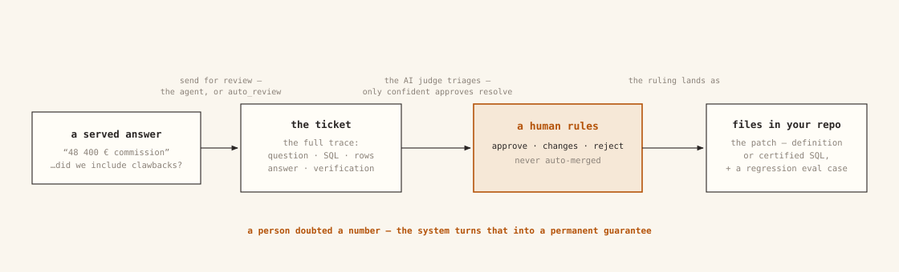
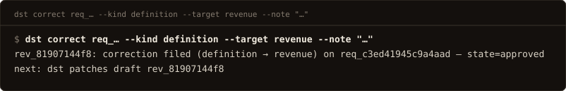
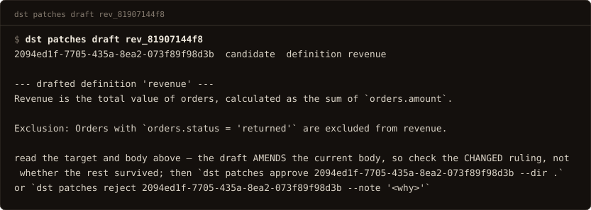
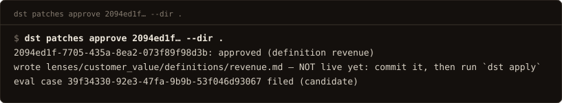

# The correction loop

Someone spots a wrong answer. In dst it ends as a fix in your files plus a test
that proves the mistake stays fixed.

[](../assets/figures/fig3b-review.svg)

The loop has four steps, and a person is in the middle of it:

1. **Someone doubts an answer.** They flag it — or dst flags it itself.
2. **dst opens a ticket** with everything needed to judge the answer: the
   question, the SQL, the rows, the answer, and how it was verified.
3. **An AI does the paperwork, a person decides.** The AI compares, triages,
   and drafts a fix. A human approves or rejects it. Nothing is ever applied
   without a person's approval.
4. **The fix becomes a file and a test.** The file goes in your repo like any
   other change. The test re-runs every time you publish, so the same mistake
   cannot quietly come back.

The rest of this page is those four steps in detail.

## A wrong answer becomes a ticket

Two ways a ticket opens:

- **A caller flags an answer.** Their AI calls the `send_for_review` tool (or
  `POST /v1/reviews`) with a note, and optionally the SQL they believe is
  right. Both are recorded as a proposed correction, not just a complaint.
- **dst flags itself.** Set `auto_review: unverified` (or `partial`, which
  covers both) in `lens.yaml` and low-confidence answers open tickets on their
  own. The queue watches the lens, not just its callers.

What lands in the ticket is the **whole story** — question, SQL, answer, row
count, verification report — so the reviewer judges the answer, not a summary
of it.

If a very similar question has already been [certified](../concepts/certified.md),
its known-good SQL is attached for comparison, and an AI judge takes a first
pass: an answer the judge explicitly approves is closed automatically, and
**everything else goes to a human** — every other verdict, and every unparseable
or empty reply. (With no AI model configured, everything goes to a human, full
stop; with no embedding provider, no certified SQL is attached to compare
against.)

People rule from the dashboard or the terminal:

```bash
dst rule <ticket> --verdict approve|changes|reject [--certify]
```

`--certify` does two things in one move: files the ruling and saves the
question with **the SQL that was served** as a
[certified answer](../concepts/certified.md) — an answer dst will from now on
serve exactly as approved, and test on every publish. It snapshots the traced
request, not the correction's proposed SQL, so use it when the served SQL was
right; take a corrected query through the patch path below instead.

[](../assets/term/correct.svg)

## A ruling becomes a fix in your files

Once a ticket is ruled on, the AI drafts the actual fix — say, an amended
definition. **The AI drafts; the human approves; there is no auto-merge.**

Where the fix lands depends on what kind of fix it is:

- A **certified answer** is server-side state: on approval it takes effect
  immediately.
- A **definition or instruction** lives in *your files*, and your files win on
  every `dst apply`. So approval writes a proposed file into your working
  tree — you review it like any code change (`git diff`), commit it, and
  apply. Until then it is not live. (If dst wrote it straight into the server
  instead, your next apply of the unchanged files would silently undo the
  fix. That is why it goes through your repo.)

[](../assets/term/patch_draft.svg)

[](../assets/term/patch_approve.svg)

A definition or instruction fix also becomes a **behavioral test case** —
marked `candidate` until a person promotes it (`status: approved` in
`evals/cases.yaml`), because a human approved the fix and a human approves the
test too. Once promoted, it re-runs on every `dst apply`. A certified fix
needs no case: the certified corpus already re-tests it.

## After the fix lands

The corrected question is served from its approved SQL from then on — the
same answer every time, cheaper and faster than generating it again. And
because every fix carries a test that re-runs on every publish, a mistake you
have caught cannot ship again unnoticed.

Tickets are not the only thing that feeds this loop. dst can also mine the
request log for recurring questions worth turning into definitions — an
admin-triggered pass, not a standing one — and
[bootstrapping from history](drift-audit.md) seeds your definitions before the
loop even starts. Everything goes through the same discipline: a draft, a
human approval, a file.
