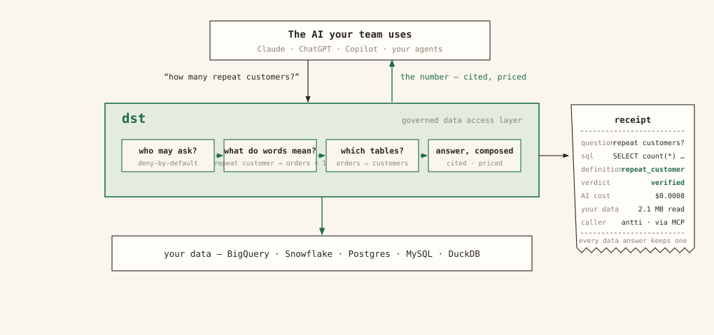
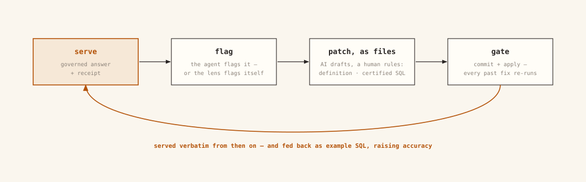

# data serve tool (dst)

dst sits between your AI and your data warehouse, and brings engineering best
practice to the whole lifecycle of serving data to AI. The AI asks questions
in plain language; dst answers them from your data and shows its work. Around
that runs the discipline: answers are **tested** on your data, changes
**deploy through gates**, and every call is **audited** with its SQL and its
cost.

## Why AI gets your numbers wrong

Point an AI at a warehouse and it will answer everything, confidently. It
never fails to answer, and that is exactly the problem. It guesses which table
means "revenue", makes up the definition on the spot, and returns a number
that looks exactly like a right one. A wrong answer is worse than no answer:
ask twice and you get two different answers, nobody can say where either came
from, and nothing stops the same mistake from happening again tomorrow.

The problem is not the model. AI is nondeterministic by nature, and no amount
of context, more of it or better of it, turns that into trust on *your* data:
what works for another team, another model, or another quarter may not work
for you. The only way to know is to test it, on your data, continuously. The
missing piece between the question and the warehouse is the thing that holds a
definition still, checks the answer against it, and remembers the last
correction.

## What dst is

Your team already asks AI about your data: in Claude, in ChatGPT, in Copilot,
or through agents you run yourselves. dst is the layer those AIs call instead
of connecting to the warehouse directly. When a question comes in, dst:

1. checks **who is asking** and what they are allowed to see;
2. looks up **what the words in the question mean for your company**, from
   definitions your team wrote;
3. writes the SQL, checks it, and runs it **read-only** against your
   warehouse;
4. returns the answer together with the SQL that produced it, a confidence
   grade, and what the call cost.

Every call is recorded: the question, the SQL, the answer, the cost, and who
asked.

There is no search box and no query screen. People ask through the AI they
already use; dst's job is making sure what comes back is right. The dashboard
is for running the system (reviewing, granting access, watching usage), not
for asking questions.

dst is not your data analyst. It is your data *janitor*: it knows which table,
which definition, which join, and serves exactly that, correctly, every time.
The AI does the thinking; dst keeps the numbers straight.

There is only one way to make AI continuously better: **test** it on your
data, **deploy** only what passes, **audit** what it served, and feed every
mistake back in as a test. dst ships that process as a framework. For the
engineer the whole product is a folder of files: edit a definition, run
`dst plan` to see what would change, `dst apply` to publish it. Around
those files runs the full lifecycle: [testing](guides/evaluation.md),
[deploying](guides/environments-and-ci.md), auditing, in the workflow data
teams already have: files, pull requests, CI, exit codes.

*The files are the product. [See it with clickable tabs →](on-screen.md)*

## How it gets more accurate over time

A better description of your data makes an AI better informed. It does not
make the system *improve*. Improving takes the testing engine: every approved
answer doubles as a regression test, every switch in the pipeline can be
flipped and re-measured, and the whole thing runs as a loop: catch a
mistake, fix it, and make sure it cannot come back. dst can run that loop
because it sits on the whole path between the question and the warehouse:

- **Changes are deployments, not edits.** Your definitions live in files, in
  version control. `dst plan` shows what a change would do before `dst apply`
  publishes it, and a broken or self-contradictory change is rejected before
  anyone can be served an answer from it.
- **A mistake fixed once stays fixed.** When someone reports a wrong answer,
  the [correction loop](guides/correction-loop.md) turns the fix into a file
  plus a test. The test re-runs on every publish, so the same mistake cannot
  quietly come back, and you can prove it.
- **Every answer shows its work.** The SQL that ran, a confidence grade, and a
  [receipt](concepts/receipts.md) anyone can check later. Every access granted
  and every access denied is logged.
- **You can watch it get better.** The observe screen counts answered,
  declined, and failed separately (a polite "I can't answer that" is an
  outcome, not an error) and tracks what every call costs. As fixes and
  [certified answers](concepts/certified.md) accumulate, the numbers improve,
  and you can point at why.

Start with [the answer path](concepts/answer-path.md), then the
[quickstart](quickstart.md). A hosted version, [dst Cloud](cloud.md), is
planned; the open-source tool is the product today.
