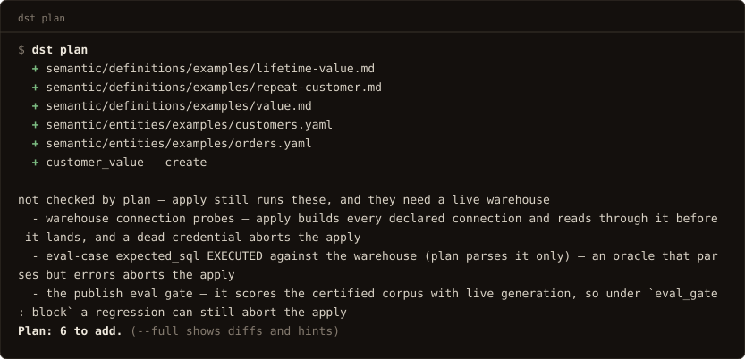
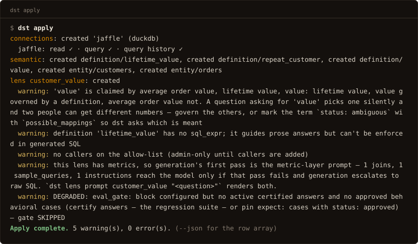
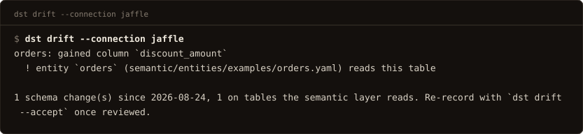
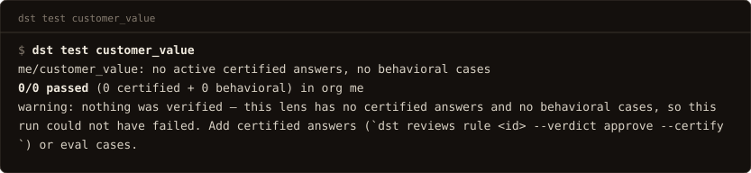
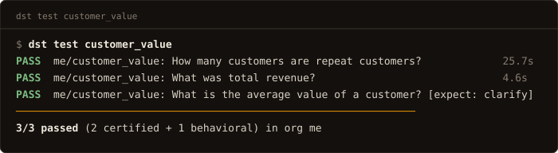
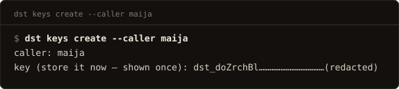
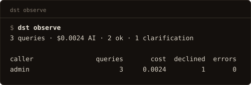

# CLI

One entry point: `dst` (`services/cli/main.py`). Two kinds of command:

- **In-process**: `init`, `dev`, `serve`, `migrate`, `doctor`, `bootstrap`, `secret`,
  `rotate-key`, `demo`, `test`, `revoke-key`, `revoke-token`, `reindex`, `probe`,
  `drift`, `import`, `export osi`, `evals migrate` run directly against the configured
  database or the local files; no server, URL, or token needed. `introspect` joins them
  whenever `dst.yaml` declares the connection, and falls back to the server when it
  does not.
- **Remote**: everything else is an HTTP wrapper over the [management API](api.md).
  Explicit `--url` / `--token` flags win; otherwise `DST_URL` and
  `DST_ADMIN_TOKEN` resolve from the process env or `./.env`; `dst init` and
  `dst bootstrap` write them, so a scaffolded project needs no flags.

`dst --version` prints the installed version.

Color: output is colored only on a TTY, and the plain bytes are identical to the
colored run's: piped output is the parse contract. `dst --no-color …` (or the
`NO_COLOR` / `DST_NO_COLOR` env vars) turns it off everywhere.

## Project lifecycle

### `dst init [dir]`

Scaffold a new project (dbt-style; see [Project files](../guides/project-files.md)).
Bare `dst init` creates `./<name>`: it never scaffolds into the cwd implicitly;
`dst init .` is the explicit way to use the current directory. Interactive by
default; every prompt has a flag for headless runs (`services/cli/init.py`).

Flags: `--name`, `--instance-name` (what your AI calls this deployment — "check
in watson ..."; default `dst`, written to `.env` as `DST_INSTANCE_NAME` and used
as the scaffolded MCP registration name), `--warehouse
demo|duckdb|postgres|bigquery|snowflake|none`, `--duckdb-path` (with `--warehouse
duckdb`: your own `.duckdb` file), `--example`/`--no-example` (the bundled
DuckDB example lens; default yes), `--db-port` (default 5432), `--api-port`
(default 8000, written to `.env` as `DST_URL`), `--yes` (accept defaults, no
prompts).

**`--skills-only` refreshes an existing project.** `AGENTS.md` and
`.claude/skills/` are a snapshot taken at init: a skill improved in a later
release never reaches a project that was scaffolded before it, and neither
`plan` nor `apply` has any way to notice. `dst init <dir> --skills-only` rewrites
exactly those files from the installed dst and reports each one as unchanged,
updated (`+N -M`) or new; it is the only init mode that runs inside a live
project, and it touches nothing else — not `dst.yaml`, not `.env`, not
`semantic/` or `lenses/`. The write is unconditional, so a local edit to a skill
is replaced rather than merged: it survives as a diff in your own git, which is
where you would review it anyway. Run it after every upgrade.

### `dst dev`

Postgres up + migrate + serve with auto-reload, one command. A reachable database is
used as-is; otherwise the project's `docker-compose.yml` is brought up and waited on by
connecting. Flags: `--host` (default 127.0.0.1), `--port` (default: the port in
`DST_URL`, else 8000).

### `dst serve`

Run the API via uvicorn; serves the built dashboard same-origin when present (source
checkout's `apps/web/dist` or the wheel's bundled copy). Without one it says so and
serves the API only. Flags: `--host`, `--port`, `--reload`.

**Refuses to start on a schema behind this build**, before it even probes the port: a
server on an out-of-date schema serves answers correctly and loses every trace in
silence, because the `request_log` writes fail in a background task nobody can see. The
message names the current revision, the one this build needs, and the unapplied list,
then tells you to run `dst migrate`; exit is 1 and no server starts. A schema
*ahead* of this build starts normally (older code on a newer schema is the safe deploy
order), and so does one whose state cannot be read, because a database still coming up is
not a broken one. Full recovery path: [Upgrading](../upgrading.md).

### `dst migrate`

Run database migrations to head against `DATABASE_ADMIN_URL`. Idempotent, and it takes a
blocking advisory lock so concurrent runs serialize instead of racing.

Says precisely what it did, so an upgrade confirms itself:

```
migrated 0037 → 0040 — 3 revisions applied (0038, 0039, 0040)
already at head (0040) — nothing to apply
schema created at 0040
```

One of those three, depending on where the database started.

### `dst doctor`

Can this install actually run? `/ready` reports what is *configured* (deliberately, and
it never gates on models), so it stays green on a fully-configured but uncallable
provider: an SDK incompatibility, a bad key, a wrong `base_url`.
`doctor` checks callability: DB schema state,
the embedder, and **one cheap real call per model tier** (`max_tokens: 8`, a fraction
of a cent) with the failure printed verbatim per tier:

```
db            ok (0058)
embeddings    ok
providers
  fast  claude-haiku-4-5    ok
  smart claude-sonnet-4-6   FAIL — anthropic: SDK call signature mismatch (…)
```

Exit 0 when every check passes, 1 otherwise. Warehouse connections are not re-probed
here; every `dst apply` already probes them and prints the capability line. Flags:
`--dir` (default `.`).

In a project directory it closes with a `skills` line — `current`, or `N behind this
dst` naming `dst init . --skills-only`. It never affects the exit code: holding an
older skill on purpose is legitimate, and this verb's 1 means *not callable*, not
*not current*.

### `dst bootstrap`

Create (or reuse) an org and mint a fresh admin token; idempotent: rerunning never
creates a duplicate org, only a new token. Saves the token to `./.env` as
`DST_ADMIN_TOKEN` when that file exists. Talks to the database directly; no server
needed. Flags: `--org` (default `default`), `--email` (create/update the first
dashboard admin), `--password` (omit to be prompted).

### `dst secret`

Generate a `DST_SECRET_KEY` (Fernet) for encrypting stored credentials.

### `dst rotate-key`

Re-encrypt every stored credential under a new `DST_SECRET_KEY`. The variable
takes a **comma-separated list**: the first key encrypts, all of them decrypt. That
is what makes rotation possible without downtime.

```
DST_SECRET_KEY=<new>,<old>   # 1. deploy — everything still decrypts
dst rotate-key               # 2. move every secret onto <new>
DST_SECRET_KEY=<new>         # 3. drop <old>
```

Refuses to run with only one key configured (override with `--force` to re-encrypt
in place). With just `<new>` set, nothing encrypted under `<old>` can be read, so the
rotation would skip every row it could not decrypt and still report success. Any row
that fails is named individually and the verb exits
non-zero. **Do not drop the old key until it exits 0.**

The server verifies the key at startup against an encrypted sentinel row and
refuses to boot on a mismatch, so a wrong key is a failed deploy rather than a 503
on whichever connector is touched first.

### `dst demo`

Publish the bundled DuckDB demo lens into an org. Flag: `--org-id` (required; the UUID
`dst bootstrap` prints).

## Files → server

### `dst plan`

Dry run of the project directory against the server. The default output is the
terraform-shaped summary: one glyph row per asset that needs attention (`+` create,
`~` update, `✗` invalid, `!` stale), then a counts line: `Plan: 1 to add, 2 to
change, 1 invalid, 11 unchanged.` `--full` prints the per-path diffs for review
flows; `--json` prints the parseable row list, including the
`scope: warehouse` rows in full — the human forms print each connection's drift
line but stay quiet about a warehouse the check could not reach
(`status: unavailable`). Shared-asset edits mark
their selecting lenses stale either way (they recompile on apply). Flags: `--full`,
`--json`, `--dir` (default `.`), `--timeout` (seconds, default 120).

Plan predicts apply: every `semantic/**` file is validated through the same seam
apply parses with, so a file apply would reject plans as `invalid` on its own
row (all of them, not just the first), and **plan exits 1**. A clean plan
exits 0.

Plan also says what it cannot predict. Every run prints a `not checked by plan`
block: warehouse connection probes, eval-case `expected_sql` actually executing,
and the publish eval gate all need a live warehouse and happen only at apply,
so a green plan is not a promise that apply succeeds. And a
`drift: '<connection>' UNARMED` footer means no committed profile exists yet, so
drift detection has no baseline to compare against; `dst probe` arms it.

One footer is about your files rather than the server's view of them: `skills: N
scaffolded file(s) differ from this dst` appears when `AGENTS.md` or a
`.claude/skills/` page no longer matches what the installed version ships —
`dst init . --skills-only` refreshes them. Only files that **exist** are compared,
so deleting a skill you don't want is silent rather than a permanent nag, and the
line never changes the exit code.

[](../assets/term/plan1.svg)

[](../assets/term/plan_diff.svg)

### `dst apply`

Deploy the project directory; files win. Blue/green and all-or-nothing: any error
aborts the whole apply (`APPLY ABORTED`, exit 1) and prior versions keep serving;
connection declarations are probed before landing. Concurrent applies conflict (409).
Exit is non-zero on **any** error, not just rejected lenses. Every stage (connections,
semantic assets, eval cases, certified answers, the lens publish) shares **one
transaction**, so a failure deploys nothing and the error line says so.

[](../assets/term/apply.svg)

[](../assets/term/apply_blocked.svg)

The default output is a grouped report: one section per scope/lens, warnings and
errors in place, a per-connection capability line (`read ✓ · query ✓ · query
history ✗ …`) for every connection the apply probed, ending in a `Apply complete.`
counts line. `--json` prints the server's raw row array: the machine shape for
agents and scripts.

Flags: `--json`, `--dir`, `--timeout` (seconds, default 300), `--probe-certified`
(execute each new certified answer once, read-only and row-capped, to record its
verified value; **new entries only**: already-stored answers are not re-probed, and
probing zero says so; re-author the `sql` or run `dst test` for a sweep. Opt-in,
costs one warehouse query per answer; a probe failure warns and stores the answer
anyway), `--require-gates` (fail closed: abort, exit non-zero, if any lens configured
for an eval gate had it *skipped* (empty suite, provider error, or unreachable
warehouse alike); by default a skipped gate publishes with a warning. CI wants this
flag: without it a provider outage silently converts a gated apply into an ungated
one that exits 0).

Lenses whose managed files match the server exactly report `unchanged` and skip the
publish path (no recompile, no version bump, no eval-gate generation), so a no-op
apply is cheap and `apply; plan` converges to zero changes. The footer adds one gate
line (`eval gates: 2 passed, 40 skipped (…)`) whenever any lens was gated.

!!! warning "A timed-out apply is still running"

    The handler is synchronous: a client disconnect cannot cancel it. If the CLI
    times out, the server still holds the org apply lock and **will commit when it
    finishes**; the message says so. Poll `dst plan` for committed state rather
    than re-applying (a second apply gets 409 while the lock is held). The first
    certified answer an org ever applies pays the embedder's cold start; raise
    `--timeout` for it. A 502/503/504 *from a proxy* is the same situation: upstream
    never answered, so that family gets the in-flight message, not the rollback one.

### `dst export`

Write server-side lenses into the project directory: the adoption path for lenses that
predate the files. Prints a `connections:` snippet to merge into `dst.yaml` by
hand; never auto-writes it, and secrets never leave the server. Flags: `--lens <name>`
(repeatable; default: everything), `--dir`.

### `dst introspect`

Print a connection's schema, agent-legible: the raw material for authoring
`semantic/` files. Flags: `--connection` (required), `--tables a,b` (subset),
`--profile`, `--json`.

`--profile` adds the facts a schema cannot give you (enum values, null rates,
ranges) by running the catalog + sampling passes against the warehouse right
there. The reads are row-capped, but it is one sampling pass per table in
scope: narrow it
with `--tables` on a wide warehouse. Without `--profile` the listing is schema
only and says `NOT PROFILED` at the top, so a bare schema is never mistaken for
a complete answer. The dst.yaml path is the one that samples; when the
command falls back to the server, the facts are whatever that connection's
profiling passes already stored.

Every non-system schema is searched, and names come back qualified
(`spider.player`); scope the connection with `schema: <name>` (or, on BigQuery,
`datasets: [a, b, c]`) under its `config` in dst.yaml. On a warehouse too wide
to list fully the unscoped listing is capped and **says `TRUNCATED`** at the top;
`--tables` is unaffected by the cap: it resolves the named tables against the
FULL catalog, at any qualification depth (`table`, `dataset.table`,
`project.dataset.table`). One column per line, `  - <name>: <type> (<warehouse
type>)`. Copy the first type, which is the value `fields[].type` takes. Use
`--json` for anything that parses rather than reads: no prose separator survives
a warehouse that can put `, ` inside a type and a space inside a name. A
connection that yields no table is an ERROR, not a blank line: the message names
the schemas searched and the command exits non-zero.

### `dst probe`

Record the warehouse's full profile **into the project**, at
`profiles/<connection>.probe.json`. `introspect --profile` prints those facts to
your terminal, where they help you author and are then gone; `probe` writes them
down: the same catalog and sampling passes plus partitions and freshness,
crossed with the entities that read each table. Flags: `--connection` (default:
every warehouse connection `dst.yaml` declares), `--tables a,b`,
`--sample-all`, `--dir`.

**Commit the artifact.** The next `dst apply` ingests it, and the value
dictionaries land in the serving prompt, so generation filters on the literals
the warehouse actually holds. A column storing `'FI'` is the difference between
an answer and this:

> *"customers in Denmark and Finland"* → `WHERE country IN ('Denmark','Finland')`
> → **zero rows**, reported as *"there are no customers in Denmark or Finland."*

Nothing errored, so nothing warned. A filter written from the question's
vocabulary instead of the column's returns a confident, empty, wrong answer, and
a committed value dictionary is what stops it. Describing the domain in a
field's `description` does the same job for facts you know; `probe` is for the
ones the warehouse knows and you have not written down.

Sampling covers the tables the semantic layer reads: everything, while the
layer is still empty. `--sample-all` samples every table (one capped read each:
the expensive form on a wide warehouse) and `--tables` pins an exact list; the
catalog pass records every table either way. Re-run it whenever the warehouse
moves (a nightly cron is the intended cadence), because a value dictionary is
only as true as its last pass.

Ingestion is advisory, never governance state: a malformed or connection-less
artifact warns and skips, a stored profile newer than the incoming one is kept
per table (a server refreshed over REST outranks an old commit), and absence
never deletes. The `drift` baseline lives in the same directory and is never
swallowed.

### `dst drift`

What has the warehouse done since you profiled it, and does the semantic layer
still match. `introspect` is a snapshot; this is the diff: new, dropped, and
retyped columns since the profile committed at `profiles/<connection>.json`, and
crucially the **cross-reference**: a new column on a table a definition or entity
reads is flagged with the asset that reads it. This is how the layer avoids
silently serving a stale derivation after the warehouse grew the real column,
e.g. *"`orders` gained `discount_amount`; definition `discount` derives it from
`list_price − unit_price` — review whether the new column supersedes the
derivation."* Findings the layer reads sort first, definition-backed ahead of
entity-only. `--json`; `--accept` re-records the baseline once you have reviewed.

`dst plan` runs a cheap version of this every time: when the warehouse has
changed since profiling it prints one line pointing you here, and it never
touches the warehouse when no baseline exists or the connection is down (the
degradation is visible only under `plan --json`). Flags: `--connection`
(required), `--accept`, `--dir`, `--json`.

[](../assets/term/drift.svg)

### `dst sql <sql>`

Run read-only SQL and see the **rows**: the governed version of opening a warehouse
client. `introspect` says what the columns are; it cannot say what they contain
together, and deciding a business rule ("is a refund a negative amount, or a row with
`status='refunded'`?") takes five actual rows. Flags: `--connection` **or** `--lens`
(exactly one, required), `--limit` (default 20, max 500), `--json`, `--dir`,
`--url`/`--token`/`--key`.

```bash
dst sql "SELECT order_id, status, amount FROM orders" --connection warehouse --limit 5
```

Guarantees, all of them the reason to use this instead of a warehouse client: one
SELECT statement, no DML/DDL anywhere (`services/runtime/sql_guard.py`, the same guard
generated SQL passes), row-capped with `truncated` said out loud when the cap fires,
and **logged to `request_log`**, so the probe behind an authoring decision sits in the
audit trail next to the answers that decision shaped.

`--connection <name>` probes the whole connection and needs an admin token: a connection
is an org-level credential, not a caller-scoped grant. It requires the connection to be
applied (this verb runs server-side; `introspect` reads dst.yaml directly and works
before the first apply). `--lens <name>` probes inside one lens's allow-list and works
with a `dst_` caller key: every table and column checked against the compiled model,
and `SELECT *` refused there, because a star is how a column the lens does not expose
would come back. Mirrored as the `sql` MCP tool.

It complements `introspect --profile` rather than repeating it: per-column enum values,
null rates and ranges come from the profile in one pass, so ask it for those. Reach here
for rows, cross-column facts, and join checks a profile cannot see.

### `dst import dbt`

One-shot import: dbt artifacts → dst-owned `semantic/` files, with a coverage
report. Never re-synced: the files are yours afterwards. Flags: `--target-dir` (the
dbt `target/` dir holding `manifest.json` + `semantic_manifest.json`, required),
`--connection` (the dst connection the tables live on, required), `--dir`.

## Ask and verify

### `dst define <term>`

Print what a governed term **means**, verbatim: the sibling of `dst query`.
`query` answers questions about *data* (governed SQL, a warehouse execution);
`define` returns the approved definition and nothing else: no generation, no
warehouse, nothing billed. Flags: `--json` (the full `DefinitionLookup`),
`--timeout`, `--dir`, `--url`/`--token`, `--key`.

`--key dst_…` looks up **as that caller**, so you see only the terms from lenses
that key may use, the same scoping `query` obeys. **Exit 1 when nothing is
governed**, so an agent branches on the code instead of parsing prose: "we have
no approved meaning for this word" is a distinct answer from any definition.

Deliberately an index lookup rather than a search: top-k retrieval over a
governed vocabulary can miss precisely the load-bearing terms, and a
definition surface that quietly returns a near-miss is worse than one that says
it has nothing.

### `dst query <lens> <question>`

Ask a governed question from the terminal: the verify step of the authoring loop.
Prints the answer, the SQL, the confidence line, and the `request_id` (`dst correct`
takes that and nothing else); a clarification prints as `clarify:` with its options.
Flags: `--json` (the full QueryResponse), `--timeout` (default 180s), `--dir`,
`--url`/`--token`, `--key`.

`--key dst_…` asks **as that caller** instead of as the admin, and it is the only way to
verify an access grant: an admin token bypasses every lens allow-list, so "I granted B
access — does it work?" answers 200 whether the grant landed or not. Grant → ask with
B's key (expect the answer) → ask with C's key (expect exit 1 and a 403). Resolves from
`DST_API_KEY` when the flag is absent; an explicit `--key` beats the admin token.

Exit codes carry the outcome, so a script can branch without parsing prose: **0** the
question was answered; **3** the lens *declined* (a refusal or a `clarify:`), which is a
governed outcome to act on, not a failure; **1** it broke (a bad request, no server, a
guard rejection). A refusal is deliberately not code 1: "I will not answer that" is the
product working. `--json` carries the same distinction as `status`.

### `dst lens prompt <lens> <question>`

Show exactly what the model sees for a question: the assembled system prompt, the prose
context, and, per authored asset, whether it reached the prompt or was dropped (not
selected, trimmed for budget, or escalation-only). No LLM or warehouse call. This is how
you catch an authored definition or dimension that validates and applies but never
reaches the model: if it isn't in this output, the model can't use it. `--json` for the
full structure.

### `dst test [lens]`

The certified corpus as the regression suite: for each active certified answer, execute
its stored SQL (the oracle) **and** run its question through generation with certified
matching disabled, then compare executed results. Approved behavioral expectations
(`expect: clarify|refuse`) run alongside, scored on response shape. Default: every
published lens in this project's org (`--all` says the lens default explicitly). A
passing answer re-stamps its bindings to current hashes: re-verification through
evidence. Runs in-process; needs a smart-tier model configured.

Exit codes carry the outcome, so a deploy gate branches without parsing prose: **0**
everything verified passed; **1** something diverged; **4** *nothing was verified*:
the lens has no certified answers and no eval cases, so the run **could not have
failed**. Treat 4 as not-green: it is the code that separates a green run over an
empty suite from a green run over a real one.

Each case prints as a ledger row (`PASS`/`FAIL`, `org/lens: question`, the divergence
when there is one, and the case's wall-clock), then a rule and the `N/M passed`
summary. `--json` emits the same rows structurally (org, lens, question, verdict,
certified/generated result, reason, `elapsed_s`) plus the summary, for CI that wants
the table rather than the exit code alone.

[](../assets/term/test.svg)

[](../assets/term/test2.svg)

Flags: `--all`, `--json`, `--dir` (default `.`), the project whose `.env` supplies
`DATABASE_URL` and the provider keys, so CI and cron can point the sweep at a project
from outside its directory. `--tag` (repeatable, any-match) runs only behavioral cases
carrying that tag: `--tag intent:discriminator` scores the routing slice on its own;
certified answers carry no tags, so a tagged run is a case slice. `--org <name>` picks
the org to sweep (default: the one this project's `DST_ADMIN_TOKEN` authenticates as —
lens names are not unique across orgs, and an unscopable run sweeps every org and says
so). `--url`/`--token`
are accepted for uniformity and **ignored** (this verb talks to the database, not to a
server); passing them prints a note saying so.

### `dst evals migrate`

Local file rewrite, no server: every value-shaped eval case (has `expected_sql`)
becomes a `certified_answers.yaml` entry; `cases.yaml` keeps only behavioral entries.
Value cases are not scored anywhere: certified answers are the regression suite.
Nothing lands until you review and `dst apply`. Flag: `--dir`.

## Governance

### `dst keys create --caller <name>` / `dst keys list`

Mint a caller and their API key (shown once), or list callers. One key per **person**,
never per tool.

[](../assets/term/keys.svg)

### `dst revoke-key --caller <name>`

Revoke the caller's active keys. In-process, immediate. Scoped to **one** org: pass
`--org`, or run from a project whose `.env` carries `DST_ADMIN_TOKEN`. Caller names
repeat across tenants, so this verb refuses to act rather than guess.

### `dst revoke-token <raw>`

**For leaks.** Kill one credential when what you have is the credential itself: the
string in the committed file, the CI log, the screenshot. Takes any kind: `dstadm_` admin
token, `dst_` caller key, `dsto_` OAuth token. You do not need to know which store it
lives in, which caller it belongs to, or which org.

```
dst revoke-token dstadm_...
revoked 1 admin_token in org 'acme'
```

Three outcomes, deliberately distinct; during containment they mean different things:

| Output | Exit | Means |
|---|---|---|
| `revoked 1 <table> in org '<name>'` | 0 | Done. The org is named so you can see which tenant you touched. |
| `already revoked (<table>)` | 0 | Someone got there first. Safe to re-run. |
| `no such credential in this database` | 1 | **Not** contained: you are pointed at the wrong deployment. Check `DATABASE_URL`. |

Unlike `revoke-key` this needs no `--org`: a token hash is unique across the database,
so there is exactly one row it can touch. Revocation takes effect on the next request;
there is no caching window.

### `dst correct <request_id>`

File a correction against a served answer: step 3 of the correction loop.
Opens the review ticket `dst patches draft` drafts the fix
from. Flags: `--kind definition|scope|number|freshness|other` (required; the drafter
routes on it), `--target` (required; the term the correction is about, used verbatim;
without it placement is vocabulary matching, which mistargets), `--note`/`--note-file`,
`--corrected-sql`, `--corrected-answer`, `--json`, `--timeout`, `--dir`,
`--url`/`--token`, `--key`.

`--key dst_…` files **as that caller**, which is the posture of the person who actually
found the wrong answer: a business user holds a caller key and no admin token. Resolves
from `DST_API_KEY` when no admin token is in scope; an explicit `--key` beats the
admin token, and an ambient admin token otherwise wins (so an analyst holding both keeps
filing org-wide).

**Scope.** A caller key may correct **only its own requests**: the ones it asked. Filing
against another caller's `request_id` is a 403, and so is reading their ticket. An admin
token files against anyone's, which is what lets the data team triage. Enforced
server-side on `/v1/reviews`, not in the CLI.

### `dst observe`

Who has been using this layer, and what for. Read-only, admin-authed, four
shapes:

```
dst observe                 headline + usage per caller
dst observe callers         who, how many, how much, how many errors
dst observe requests        what they actually asked
dst observe show <req_id>   one request: question, SQL, confidence
```

Flags: `--lens`, `--status ok|refused|error` (with `requests`), `--limit` (default
50; the server caps it at 10000 — there is no cursor, so the cap is the only page),
`--json`, `--timeout`, `--dir`, `--url`/`--token`.

The bare form is the answer to "the CFO wants to know who has been using the
reporting tool": one line of totals, then a row per caller. `requests --status
error` is the fastest way to find a metric that is failing repeatedly: a caller
retrying the same question three times in two minutes is visible here and
nowhere else.

[](../assets/term/observe3.svg)

### `dst reviews`

List the review queue, all states and origins. Flags: `--state
open|ai_review|needs_human|approved|changes|rejected`, `--origin ai|human` (`ai` =
auto-flagged by a lens's `auto_review` policy), `--json` (machine-readable,
unfiltered by default), `--watch` (poll `needs_human`, print each new ticket once with
its question; Ctrl-C stops), `--interval` (watch poll seconds, default 30), `--dir`,
`--url`/`--token`, `--key`.

With `--key dst_…` (or a project whose `.env` holds only `DST_API_KEY`) this reads
the caller-scoped list instead: **the tickets on your own requests**, and their state,
the other half of the loop for whoever filed the correction. The whole-queue view stays
admin-only, as does `--watch`.

### `dst rule <ticket_id>`

Rule on a review ticket. Flags: `--verdict approve|changes|reject` (required),
`--reasoning`, `--certify` (after an approve, promote the request's question→SQL to a
certified answer in the same act; requires `--verdict approve`). See
[The correction loop](../guides/correction-loop.md).

### `dst patches list --lens <name>` / `dst patches approve <id>`

The self-healing loop's ruling from the repo: approving a definition/skill patch writes
the server's **proposed file** into the working tree: review it with `git diff`, land
it with `dst apply`; nothing is live until you do. Flags: `--status
candidate|approved|rejected` (list), `--json`, `--dir`.

### `dst lens list`

The deployed lenses, from the **server**: name, status, shape (entities/definitions),
query volume, and origin. Files and server state diverge by design (file absence never
deletes; a lens created through the API is server-only until adopted), and this is the CLI
read path for that: a lens marked `not in files` is the adoption cue;
`dst export --lens <name>` brings it under the project. `--json` for the raw rows.

### `dst lens log <name>`

The lens's published history as a change log, newest first: version, date, who
published it (a dashboard user, an admin token by label, or a server process such as a
recompile), and the summary the publish recorded. This answers "what changed on this
lens and who did it" in the terminal where the apply just ran; the dashboard's History
panel shows the same trail with diffs. `--json` for the raw rows.

### `dst lens rm <name>`

Delete a lens on the server. Prints the cascade first (versions, certified answers,
eval cases, context chunks, patch candidates; the request log and rulings survive as
history) and asks; `--yes` for headless. File absence never deletes: this verb is the
only way.

### `dst semantic rm entity|definition <name>`

Remove a shared semantic asset. The server refuses while any published lens still
selects it, and names the lenses.

### `dst connection rm <name>`

Delete a server-side connection (its stored credentials go with it). Dependent
lenses are checked first and the verb refuses while any still reads through the
connection: re-point or `dst lens rm` them before retrying; `--yes` for headless.
File absence never deletes: a connection dst.yaml still declares is re-created on
the next apply, so remove the declaration too when you mean gone.

## Maintenance

### `dst reindex`

Re-embed all stored vectors with the configured embedder; required after changing the
embedding model or dimension (the write-path guard blocks mismatched writes until
then). Resumable. Flag: `--batch` (rows per committed batch, default 64).

*(Verified against `services/cli/main.py` and `services/cli/init.py`. Not every flag
is listed here — `dst <verb> --help` is the exhaustive one.)*
